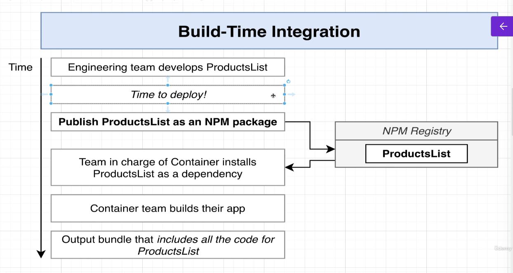
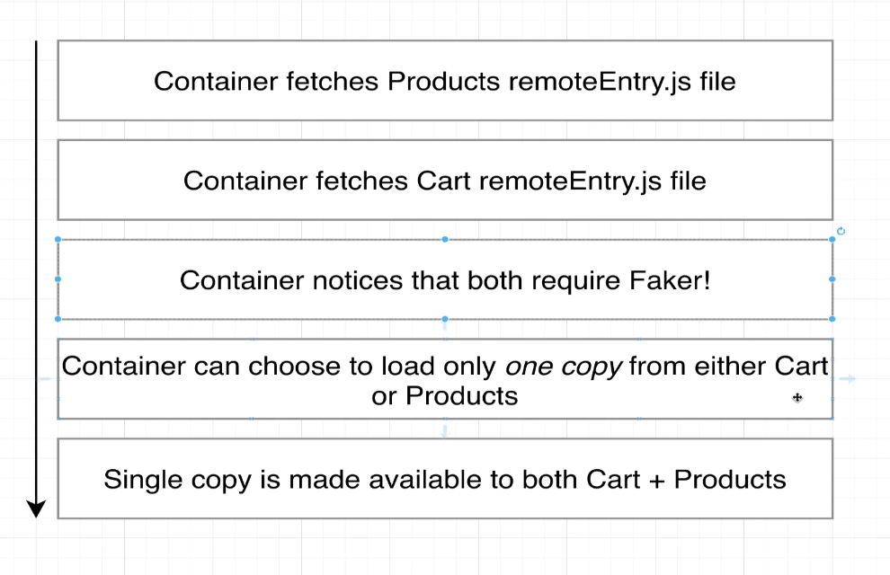
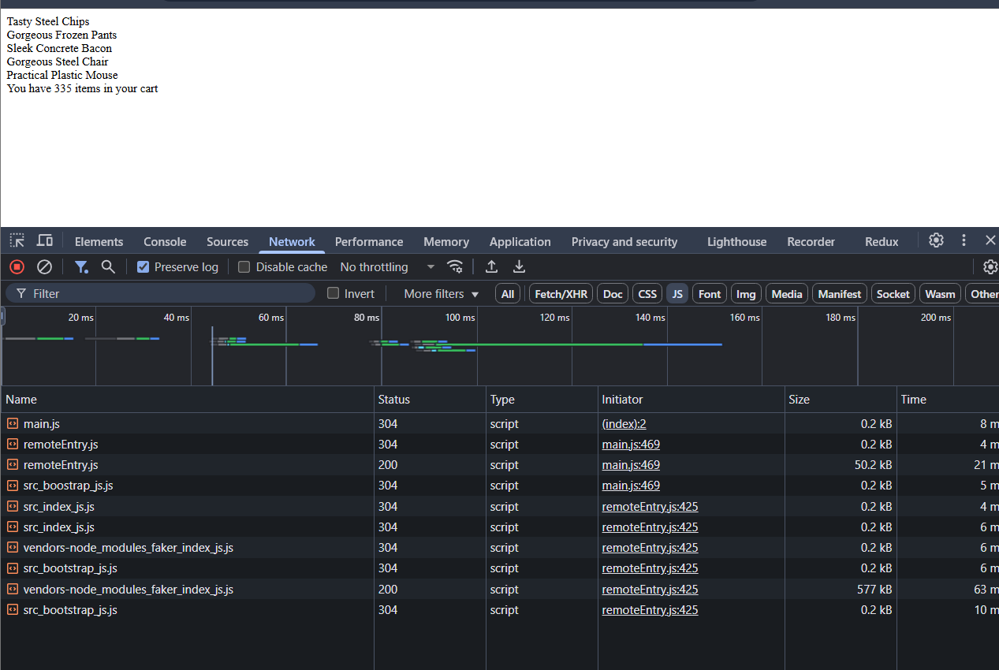

# Microfrontends in React
- Consider an ecommerce application
- 
- 
- To turn it into micro-frontend application
- Identify the major features
- 
- Split it into 2 applications
- 
- 
- 
- 
- We could have 2 separate teams to develop each of the applications
- 

## Application Overview
- We will make an ecommerce store
- 
- If we were making a monolithic app it will look like this
- 
- If we make a micro-frontend it will look like this:
- 
- How do we decide where to show each of these microfrontends on the screen
- So we can create a container app
- This container app decides when and where to show each micro-frontend
- 

### Understanding Build-time integration
- 
- 
- 
- 
- It is easy to set up and understand. However, container has to be re-deployed everytime ProductsList is updated
- It is tempting to couple the container and ProductsList together.

### Understanding the Run-time integration
- 
- Advantage of this approach is ProductsList can be deployed independently at any time
- Also, different versions of ProductsList can be deployed and Container can decide which one to use
- However, tooling and setup is far more complicated.
- 
- Run-time integration with Webpack module integration is usually the best approach

### Project Setup with Run-time integration
- We will create separate folders for each of our front-ends
- 
- 

### Understanding Webpack
- 
- Initially we used the fakers library to create a list of products in index.js as follows
```js
import faker from 'faker';
let products = '';
for(let i=0; i<3; i++){
    const name = faker.commerce.productName(i);
    products += `<div>${name}</div>`;
}

console.log(products);
```
- Now we created a webpack.config.js file and added the following code to it
```js
module.exports = {
    mode: "development",
};
```
- Then we went to package.json and in the scripts section added: "start":"webpack"
- When we ran npm run start, it created a dist folder which had a main.js file
- 
- Basically, Webpack is used to combine many JS files into a single JS file
- 
- When we load up our project in the browser, we dont want to load up a bunch of different files
- Thats where Webpack comes into play.
- It combines several JS files into a single file.
- main.js or bundle.js file is the output of webpack, it even includes the JS files of the dependencies we had included as well.
- In the above example, it included code for the faker library also
- We want to execute the main.js file in the browser and generate HTML
- So we need a webpack Dev Server
- 
- For this, we just need to make a small change in the webpack.config.js file
```js
module.exports = {
    mode: "development",
    devServer: {
        port: 8081,
    }
};

```
- Then we create an index.html page for Products
- Rather than explicitly referencing main.js file generated by webpack be added within script tags in the page, we will have Webpack figure it out for us
- Files generated by webpack have unpredictable names
- 
- So we will use webpack html plugin
- It will take a look at files coming out of webpack and automatically insert it into the HTML document
- 
- Make following changes to webpack.config.js file
```js
const HtmlWebpackPlugin = require('html-webpack-plugin');

module.exports = {
    mode: "development",
    devServer: {
        port: 8081,
    },
    plugins: [
        new HtmlWebpackPlugin({
            template: './public/index.html',
        })
    ]
};
```
- When we now run npm run start, it will start up the server and show contents of what we have logged
- 
- if we update index.js, it is automatically picked up by webpack and content inside the browser is automatically refreshed.

### Scaffolding the Container
- We will do the exact same steps as we did for Product earlier and have an empty HTML page, add the webpack.config.js files and add an index.js file which is as follows
```js
console.log('Container');
```
- We will also have a webpack.config.js file
```js
const HtmlWebpackPlugin = require("html-webpack-plugin");

module.exports = {
    mode: 'development',
    devServer: {
        port: 8080,
    },
    plugins: [
        new HtmlWebpackPlugin({
            template: './public/index.html',
        })
    ]
}
```

## Basics of Module Federation
- Now we need to set up our integration process.
- We need to call Products from the Container
- 
- For this go to the products folder and inside its webpack.config.js add the following code
```js
const HtmlWebpackPlugin = require('html-webpack-plugin');
const ModuleFederationPlugin = require('webpack/lib/container/ModuleFederationPlugin');
module.exports = {
    mode: "development",
    devServer: {
        port: 8081,
    },
    plugins: [
        new ModuleFederationPlugin({
            name: 'products',
            filename: 'remoteEntry.js',
            exposes:{
                './ProductsIndex':'./src/index'
            }
        }),
        new HtmlWebpackPlugin({
            template: './public/index.html',
        })
    ]
};
```
- Note that remoteEntry.js specifies the various modules that can be loaded from the Products project
- Further, in the webpack.config.js file of the container application, we have this code:
```js
const HtmlWebpackPlugin = require("html-webpack-plugin");
const ModuleFederationPlugin = require("webpack/lib/container/ModuleFederationPlugin");
module.exports = {
    mode: 'development',
    devServer: {
        port: 8080,
    },
    plugins: [
        new ModuleFederationPlugin({
            name: 'container',
            remotes:{
                products : 'products@http://localhost:8081/remoteEntry.js'
            }
        }),
        new HtmlWebpackPlugin({
            template: './public/index.html',
        })
    ]
}
```
- This code looks mysterious at first
- Notice that when we run the products code(running on localhost:8081) from container project(localhost:8080), we can go to network tab and see this
- 
- Notice that 3 files are coming from localhost:8081
- We can explain this process with the following diagram:
- 
- Think of remoteEntry.js file as a sort of directions for other projects. 
- These directions tell the container how to load source code from the products project
- The src/index.js contains the actual code exposed by the products project
- Micro-frontends in React using the Module Federation Plugin (part of Webpack 5) allow you to break a large React application into smaller, independently deployable modules. 
- Each module can be developed, tested, and deployed separately, yet they integrate seamlessly at runtime. This approach improves scalability, team autonomy, and code maintainability.
- Module Federation enables a JavaScript application to dynamically load code from another application or module at runtime.
- Each micro-frontend is a standalone app with its own build process, but they share dependencies and expose components or modules to one another.
- A host application loads remote modules (exposed by other apps) using Webpack's configuration.
- Real-World Examples
- E-commerce Platform: A retail site splits its UI into micro-frontends:
- Product catalog (React app)
- Shopping cart (React app)
- User authentication (React app) Each team works independently, deploying updates without affecting others. 
- The cart module can be reused across the main site and mobile app.

### Understanding how Module Federation Plugin works in Container Application
- 
- Why do we need index.js file inside container application? Especially when all it contains is import('./bootstrap')
- This basically is because Webpack knows that it is has to fetch something from products before running this file
- 
- The bootstrap.js file contains:
```js
import 'products/ProductsIndex';

console.log('Container');
```
- Overall the big picture looks like this:
- 
- This can further be explained by this
- 

### Understanding Configuration Options inside the Module Federation Plugin
- 
- Notice that inside bootstrap.js we have:
```js
import 'products/ProductsIndex';

console.log('Container');
```
- This basically looks for 'products' inside the remotes section of the Module Federation Plugin inside webpack.config.js file of the container application
- There we can find the location of products list(in this case: localhost:8081/remoteEntry.js)
- 
- We can have multiple modules or components or files inside the Products application
- We can choose what to expose to the outside containers
- Another example is this
- 
- Let's just say we just want barchart
- We can specify that as following in the Container
- 

### Scaffolding the Cart
- 
- We will do the same exact steps as product
- Add a package.json and install all the dependencies(same as product)
- Next, add an index.js and add the following code to it
```js
import faker from "faker";

const cartText = `<div>You have ${faker.random.number()} 
                        items in your cart</div>`

document.querySelector("#dev-cart").innerHTML = cartText;
```
- Next add an index.html with the following code:
```html
<!DOCTYPE html>
<html>
<head>

</head>
<body>
<div id="dev-cart"></div>
</body>
</html>
```
- Next add a webpack.config.js and expose the cart Index page
```js
const HtmlWebpackPlugin = require('html-webpack-plugin');
const ModuleFederationPlugin = require('webpack/lib/container/ModuleFederationPlugin');

module.exports = {
    mode: 'development',
    devServer: {
        port: 8082,
    },
    plugins: [
        new ModuleFederationPlugin({
            name: 'cart',
            filename: 'remoteEntry.js',
            exposes:{
                './CartShow':'./src/index'
            }
        }),
        new HtmlWebpackPlugin({
            template: './public/index.html'
        })
    ]
}
```
- If we just run the cart in isolation we get this:
- 

### Cart Integration
- First modify the webpack.config.js file of container application as follows:
```js
const HtmlWebpackPlugin = require("html-webpack-plugin");
const ModuleFederationPlugin = require("webpack/lib/container/ModuleFederationPlugin");
module.exports = {
    mode: 'development',
    devServer: {
        port: 8080,
    },
    plugins: [
        new ModuleFederationPlugin({
            name: 'container',
            remotes:{
                products : 'products@http://localhost:8081/remoteEntry.js',
                cart:'cart@http://localhost:8082/remoteEntry.js',
            }
        }),
        new HtmlWebpackPlugin({
            template: './public/index.html',
        })
    ]
}
```
- Next add the cart import to boostrap:
```js
import 'products/ProductsIndex';
import 'cart/CartShow'

console.log('Container');
```
- Next add a div with id of dev-cart inside the index.html file of the container app
```html

<!DOCTYPE html>
<html>
<head></head>
<body>
<div id="dev-products"></div>
<div id="dev-cart"></div>
</body>
</html>
```
- Finally, when we run it, we can see this
- 
- Notice that we can see items in the cart alongside the products list

### What the development process looks like while using Micro-frontends
- 
- Notice the role of the html files
- ~~~~
- We only use HTML files from the container application in Production
- HTML files from products and cart are only for testing in development process

## Sharing Dependencies Between Apps
- Both Products and Cart need the faker module
- 
- As we can see the faker dependency is being loaded twice(notice the vendor-node_modules file)
- 
- It is almost 2.9 MB large
- We would want both Product and Cart to share this dependency and load it up only once not twice
- We can do this as follows:
- 
- We just need to change a couple of configuration options
- We include the option of shared
```js
const HtmlWebpackPlugin = require('html-webpack-plugin');
const ModuleFederationPlugin = require('webpack/lib/container/ModuleFederationPlugin');
module.exports = {
    mode: "development",
    devServer: {
        port: 8081,
    },
    plugins: [
        new ModuleFederationPlugin({
            name: 'products',
            filename: 'remoteEntry.js',
            exposes:{
                './ProductsIndex':'./src/index'
            },
            shared:['faker'],
        }),
        new HtmlWebpackPlugin({
            template: './public/index.html',
        })
    ]
};
```
- We would do the same changes to cart
- No changes to container are required
- Notice that the vendor-node_modules_faker_index_js.js file is loaded only once
- 
- But now Product Application doesnot work in isolation
- 
- Since faker is marked as a shared module, it only loads up asynchronously. 
- It is not available for use inside the index.js file of Products
- Remote Entry file has the time to load it up asynchronously, but it doesnot work in direct access to Products Application
- Everything works inside the Container App but Cart App and Products App are broken

### Async Script Loading
- To fix this, we use the same pattern we use inside our container project
- Add a bootstrap.js file inside the src folder and copy paste the code from index.js into bootstrap.js
- Inside the index.js file include the following code:
```js
import('./bootstrap');
```
- Now everything works
- 
- Container app also keeps working as before
- We just have an extra request for bootstrap.js file
- We need to do the same steps for Cart Application also

### Shared Module Versioning
- What if the faker module is on different versions on different applications
- If we install faker on cart app to be of 5.5.3 version and on products app to be 4.1.0 version
- In this case, inside the container app, the faker library is loaded twice
- 
- This is correct and expected as different projects use different versions
- We don't want our projects to use same copy of faker as they have different versions
- Module Federation plugin takes a look at the versions used in package.json of each of the projects
- If it detects different versions, it loads up both of them
- If they use the same version, it loads it up only once.

### Singleton Loading
- Inside the module federation plugin, there are other modules like React which cannot be loaded multiple times into the browser
- We cannot have multiple copies of React running
- To simulate this, lets install different incompatible versions of faker module
- Also lets change the product and cart webpack config file as follows:
```js
const HtmlWebpackPlugin = require('html-webpack-plugin');
const ModuleFederationPlugin = require('webpack/lib/container/ModuleFederationPlugin');
module.exports = {
    mode: "development",
    devServer: {
        port: 8081,
    },
    plugins: [
        new ModuleFederationPlugin({
            name: 'products',
            filename: 'remoteEntry.js',
            exposes:{
                './ProductsIndex':'./src/index'
            },
            shared:['faker'],
            // shared: {
            //     faker:{
            //         singleton: true,
            //     }
            // },
        }),
        new HtmlWebpackPlugin({
            template: './public/index.html',
        })
    ]
};
```
- Notice that we are forcing it use a singleton object for faker module
- Products will have 4.1.0 and Cart will have 5.1.0 version
- When we run container, it will load up one copy, but it will also show a warning message:
- 
- It is a sign from webpack saying it was not able to load up the versions as expected.

### Sub-App Execution Context
- Remember that we still need to run Products and Cart independently of the Container
- But we are making a very big assumption
- Remember we load up everything inside the div with an id: "dev-products" and "dev-cart"
- We expect the container app to have the same div ids.
- This may not be always possible as all 3 application are developed by different teams
- We need to refactor our bootstrap.js file in product and cart applications
- We make the following changes to our bootstrap.js in products to handle all the scenarios
```js
import faker from 'faker';

const mount = (el) =>{
    let products = '';
    for(let i=0; i<5; i++){
        const name = faker.commerce.productName(i);
        products += `<div>${name}</div>`;
    }

    el.innerHTML = products;
    //Can work with different frameworks like React
    //ReactDOM.render(<App />,el);
}

//Context/Situation #1
// Running this file in development in isolation with an id of dev-products
//We want to render our app into an id of dev-products
//Remember in webpack config we set mode to development or production
if(process.env.NODE_ENV !== 'production'){
 const el = document.querySelector('#dev-products');
 //Assuming our container doesnot have an element with id of dev-products
 if(el)
 {
     //We are probably running in isolation
     mount(el);
 }
}


//Context/Situation #2
//Running this file in development or product through container app
//No guarantee that an element with id of dev-products might exist
//So we donot want to immediately render the app, if element doesnot exist
//We will not call the mount function immediately
//Using the export function, we can force the container to decide when to load the app on the screen
export {mount};

```
- Now if run the products app in isolation, it works fine.
- But now we will also have to make some changes to the container app since we are now exporting the mount function
- Before, we make changes to container, we need to change webpack.config file to refer to the bootstrap file instead
```js
 exposes:{
                './ProductsIndex':'./src/bootstrap'
         },
```
- Next we will make changes to bootstrap.js file of container as follows
- Note that it is importing the mount function and using that function to display products using its own custom div ID
```js
import {mount} from 'products/ProductsIndex';
import 'cart/CartShow'

console.log('Container');

mount(document.querySelector('#my-products'));
```
- We will make similar changes to cart also
- Change the bootstrap file as follows:
```js
import faker from "faker";


const mount = (element) => {
    const cartText = `<div>You have ${faker.random.number()} 
                        items in your cart</div>`
    element.innerHTML = cartText;
}

// Running in Development Environment
if(process.env.NODE_ENV !== "production") {
    const el = document.querySelector('#dev-cart');
    if(el) {
        mount(el);
    }
}

//Running in Production
export {mount};
```
- Change the webpack.config of cart as follows
```js
 exposes:{
                './CartShow':'./src/bootstrap'
         },
```
- Change the code for bootstrap.js for container app as follows:
```js
import {mount} from 'products/ProductsIndex';
import {mount as mountCart}  from 'cart/CartShow';


console.log('Container');

mount(document.querySelector('#my-products'));
mountCart(document.querySelector('#my-cart'));
```

### Bug in Module Federation Plugin
- Remember we had to provide a name to our export inside webpack.config file
```js
plugins: [
        new ModuleFederationPlugin({
            name: 'cart',
            filename: 'remoteEntry.js',
            exposes:{
                './CartShow':'./src/bootstrap'
            },
            shared: ['faker'],
            // shared: {
            //     faker:{
            //         singleton: true,
            //     }
            // },
        }),
```
- Then when we import it inside container we have the following:
```js
const HtmlWebpackPlugin = require("html-webpack-plugin");
const ModuleFederationPlugin = require("webpack/lib/container/ModuleFederationPlugin");
module.exports = {
    mode: 'development',
    devServer: {
        port: 8080,
    },
    plugins: [
        new ModuleFederationPlugin({
            name: 'container',
            remotes:{
                products : 'products@http://localhost:8081/remoteEntry.js',
                cart:'cart@http://localhost:8082/remoteEntry.js',
            }
        }),
        new HtmlWebpackPlugin({
            template: './public/index.html',
        })
    ]
}
```
- However there is a bug
- Inside the remoteEntry.js file we have this variable
- 
- This cart variable loads up all the code inside that remoteEntry file
- If we change cart:'cart@http://localhost:8082/remoteEntry.js' to cart:'mycart@http://localhost:8082/remoteEntry.js',
- We now start seeing an error
- We have to be careful as to how to name the cart variable.
- But now lets say we go to our index.html file and change selector in container index.html file from 'my-cart' to just 'cart'
- We also make similar changes in our bootstrap.js to reference this cart selector as follows
```js
//mountCart(document.querySelector('#my-cart'));
mountCart(document.querySelector('#cart'));
```
- In theory everything should work fine.
- But we get this error:
- 
- This is because cart is being created a global variable
- 
- 
- This is really misleading and is a BUG in Module Federation Plugin
- If we have a selector inside HTML as the same name as what we are trying to expose('cart' in this case)
- It will give error as that selector id #cart will overwrite the 'cart' global variable that is being exposed from cart application 
- We need to make sure our elements in our DOM don't have the same ID which is exposed inside the remoteEntry.js file

## Linking Multiple Apps Together
- We will build a software as a service application
-  (Landing Page)
-  (Pricing Page)
-  (Sign In Page)
-  (SignUp Page)
-  (Dashboard Page)
- We can group these pages together
- 
- We will build 3 different micro-frontends:
- 
- Please note integration techniques are identical irrespective of the frontend technology used

### Establishing the Requirements that drive architecture choices
- 
- 
- Our Project has specific requirements:
- 
- We can only use shared libraries through module federation system
- If there is tight coupling between Marketing and Authentication, if in the future, we replace Marketing, we will need to make changes to Authentication also
- In some years, React will be an ancient framework
- It is better to isolate applications
- 
- We also need to make sure if the user logs in, then we should change text of Login button to Logout button
- We need to have some communication between child and parent
- 
- 
- 

### Initial Webpack Config
- We don't use create-react-app or Vue CLI because both are currently shipping with a version of webpack that doesnot have Module Federation Plugin
- Remember Module Federation Plugin was introduced in Webpack 5
- This may change in the future
- 
- We will create 2 files for webpack instead of 1 file being used earlier.
- We need to specify Webpack configs for Production and Development
- We will have a third file which will have some configuration common for both development and production
- This pattern will be common for all projects
- To start off inside the marketing project, we will create a folder: config and inside that specify 3 files
- webpack.common.js, webpack.dev.js and webpack.prod.js
- Inside the webpack.common.js we will have the following code
```js
module.exports = {
    module: {
        rules: [
            //Loader tells Webpack to process some different files as we start to import them to our project
            //First loader we use is Babel, which is in charge of processing all code from ES2015,16,17,etc to regular ES5 code
            //which can easily be executed inside a typical browser
            {
                //Process all mjs and js files by babel
                test: /\.m?js$/,
                exclude: /node_modules/,
                use:{
                    loader: 'babel-loader',
                    options: {
                        //babel will process all JSX tags
                        presets: ['@babel/preset-react','@babel/preset-env'],
                        //Add in some code to enable some additional features like async/await syntax
                        plugins:['@babel/plugin-transform-runtime']
                    }
                }
            }
        ]
    }
}
```
- Inside the webpack.dev.config, we will have the following code:
```js
//Can be used to merge 2 different webpack config objects
//Helps to merge webpack config from the common file into dev config
const {merge} = require('webpack-merge');
const HtmlWebpackPlugin = require('html-webpack-plugin');
const commonConfig = require('./webpack.common');

const devConfig = {
    mode: 'development',
    devServer: {
        port: 8081,
        historyApiFallback: {
            index: 'index.html',
        }
    },
    plugins: [
        new HtmlWebpackPlugin({
            template: './public/index.html',
        })
    ]
};

//export the merge of common config and devConfig
module.exports = merge(commonConfig, devConfig)

```
- We will create a src/index.js file and public/index.html file and run the marketing project
- Remember earlier when we had 2 projects which were sharing dependencies and when we had to run them in isolation, they used to fail
- We added a bootstrap.js and imported it inside index.js file
- We are going to do something similar for marketing project
- We will create a bootstrap.js and add the following code:
```js
import React  from "react";
import ReactDOM from "react-dom";

// Mount function to start up the app
//Inside this function, we call ReactDOM.render method to display the text inside a placeholder on the page
const mount = (el) =>{
    ReactDOM.render(
        <h1>Hi there!</h1>,
        el
    )
}
// If we are in development and in isolation
// Call mount immediately
if(process.env.NODE_ENV === "development"){
    const devRoot = document.querySelector('#_marketing-dev-root');
    if(devRoot){
        mount(devRoot);
    }
}

//We are running through container, and we should export the mount function
export {mount};
```

## Generic Ties between Projects
- First we are going to import the Landing and Pricing Components and display them 
- Rather than dump everything in bootstrap.js file, we are going to create another file app.js with the following code:
```js
import React from 'react';
import {Switch, Route, BrowserRouter} from 'react-router-dom';
import {StylesProvider} from '@material-ui/core/styles';

import Landing from './components/Landing';
import Pricing from './components/Pricing';

export default () =>{
    return <div>
        <StylesProvider>
            <BrowserRouter>
                <Switch>
                    <Route exact path="/pricing" component={Pricing} />
                    <Route exact path="/" component={Landing} />
                </Switch>
            </BrowserRouter>
        </StylesProvider>
    </div>
}
```
- Now we are going to call this inside bootstrap.js file and render the App 
```js
import React  from "react";
import ReactDOM from "react-dom";
import App from "./App";

// Mount function to start up the app
const mount = (el) =>{
    ReactDOM.render(
        <App/>,
        el
    )
}
// If we are in development and in isolation
// Call mount immediately
if(process.env.NODE_ENV === "development"){
    const devRoot = document.querySelector('#_marketing-dev-root');
    if(devRoot){
        mount(devRoot);
    }
}

//We are running through container, and we should export the mount function
export {mount};
```
- This shows output as follows:
- 

### Setting up the Container
- We will follow the same steps
- Setup webpack.dev.config, webpack.common.config and webpack.prod.config files
- Then we will setup src folder with bootstrap.js and index.js
- Then we will create a public folder with index.html file inside of it
- Inside our bootstrap.js we will have the following code:
```js
import React  from "react";
import ReactDOM from "react-dom";
import App from "./App";

ReactDOM.render(<App />, document.querySelector("#root"));
```
- We will create a file App.js and have the following code inside of it
```js
import React from 'react';

export default () =>{
    return <h1>Hi there!</h1>
}
```

### Integration of Container and Marketing
- We are again going to make use of the Module Federation Plugin
- From the marketing app, we are going to expose the bootstrap file
- For this we will make the following changes in webpack.dev.js file for marketing
```js
//Can be used to merge 2 different webpack config objects
//Helps to merge webpack config from the common file into dev config
const {merge} = require('webpack-merge');
const HtmlWebpackPlugin = require('html-webpack-plugin');
const ModuleFederationPlugin = require('webpack/lib/container/ModuleFederationPlugin');
const commonConfig = require('./webpack.common');


const devConfig = {
    mode: 'development',
    devServer: {
        port: 8081,
        historyApiFallback: {
            index: 'index.html',
        }
    },
    plugins: [
        new ModuleFederationPlugin({
            name: 'marketing',
            filename: 'remoteEntry.js',
            exposes: {
                './MarketingApp': './src/bootstrap'
            }
        }),
        new HtmlWebpackPlugin({
            template: './public/index.html',
        })
    ]
};

//export the merge of common config and devConfig
module.exports = merge(commonConfig, devConfig)

```
- From the container app we are going to import the remoteEntry file exposed by marketing app
- For this we will make the following changes to webpack.dev.config file for container
```js
//Can be used to merge 2 different webpack config objects
//Helps to merge webpack config from the common file into dev config
const {merge} = require('webpack-merge');
const HtmlWebpackPlugin = require('html-webpack-plugin');
const ModuleFederationPlugin = require('webpack/lib/container/ModuleFederationPlugin');
const commonConfig = require('./webpack.common');

const devConfig = {
    mode: 'development',
    devServer: {
        port: 8080,
        historyApiFallback: {
            index: 'index.html',
        }
    },
    plugins: [
        new ModuleFederationPlugin({
            name:'container',
            remotes:{
                marketing: 'marketing@http://localhost:8081/remoteEntry.js'
            }
        }),
        new HtmlWebpackPlugin({
            template: './public/index.html',
        })
    ]
};

//export the merge of common config and devConfig
module.exports = merge(commonConfig, devConfig)

```
- Now we can use this inside our App.js file inside container like this
```js
import React from 'react';
import {mount} from 'marketing/MarketingApp'

console.log(mount)

export default () =>{
    return <h1>Hi there!</h1>
}
```

### Why import the mount function?
- The mount function takes in an HTML element as an argument and displays some content inside of it
- 
- But a question arises, why cant the Marketing App expose a React component which we can use inside container
- This is because of inflexible requirement #2. There should be zero coupling between container and child apps
- 
- What if container is in Vue.js and marketing is in React.js
- We want communication to be as generic as possible
- This is why we use a mount function

### Generic Integration(Using mount function inside the container app)
- First of all we will create a marketing component inside the container app
- This component takes an import of the mount function and passes reference to its own div to render the content from marketing
```js
import {mount} from 'marketing/MarketingApp'
import React,{useRef,useEffect} from 'react'

export default () =>{
    const ref = useRef(null)
    useEffect(()=>{
     mount(ref.current)
    })
    return <div ref={ref}>

    </div>
}
```
- Now we will use this component inside container's App.js file like this:
```js
import React from 'react';
import MarketingApp from "./components/MarketingApp";

export default () =>{
    return <>
    <h1>Hi there!</h1>
        <hr/>
        <MarketingApp />
    </>
}
```
- This renders the application like this:
- 
- 
- Note that when we load up the container app, it has files from both container app and marketing app
- Note that 2 copies of React are being loaded as container uses React and Marketing uses React
- For this we can use the shared option of the Module Federation Plugin:
- First we will make changes to webpack.dev.config inside marketing app
```js
//Can be used to merge 2 different webpack config objects
//Helps to merge webpack config from the common file into dev config
const {merge} = require('webpack-merge');
const HtmlWebpackPlugin = require('html-webpack-plugin');
const ModuleFederationPlugin = require('webpack/lib/container/ModuleFederationPlugin');
const commonConfig = require('./webpack.common');


const devConfig = {
    mode: 'development',
    devServer: {
        port: 8081,
        historyApiFallback: {
            index: 'index.html',
        }
    },
    plugins: [
        new ModuleFederationPlugin({
            name: 'marketing',
            filename: 'remoteEntry.js',
            exposes: {
                './MarketingApp': './src/bootstrap'
            },
            shared: ['react', 'react-dom'],
        }),
        new HtmlWebpackPlugin({
            template: './public/index.html',
        })
    ]
};

//export the merge of common config and devConfig
module.exports = merge(commonConfig, devConfig)

```
- Similarly we will make changes to webpack.dev.config inside container app
```js
//Can be used to merge 2 different webpack config objects
//Helps to merge webpack config from the common file into dev config
const {merge} = require('webpack-merge');
const HtmlWebpackPlugin = require('html-webpack-plugin');
const ModuleFederationPlugin = require('webpack/lib/container/ModuleFederationPlugin');
const commonConfig = require('./webpack.common');

const devConfig = {
    mode: 'development',
    devServer: {
        port: 8080,
        historyApiFallback: {
            index: 'index.html',
        }
    },
    plugins: [
        new ModuleFederationPlugin({
            name:'container',
            remotes:{
                marketing: 'marketing@http://localhost:8081/remoteEntry.js'
            },
            shared: ['react', 'react-dom'],
        }),
        new HtmlWebpackPlugin({
            template: './public/index.html',
        })
    ]
};

//export the merge of common config and devConfig
module.exports = merge(commonConfig, devConfig)

```
- Now when we load up container app, we see something like this:
- 
- It might get tedious to write up these shared modules array
- One option is to get the packageJson as a JSON object inside our webpack.dev.config file
- We can then pass the dependencies to the shared array as follows:
```js
//Can be used to merge 2 different webpack config objects
//Helps to merge webpack config from the common file into dev config
const {merge} = require('webpack-merge');
const HtmlWebpackPlugin = require('html-webpack-plugin');
const ModuleFederationPlugin = require('webpack/lib/container/ModuleFederationPlugin');
const commonConfig = require('./webpack.common');
const packageJson = require('../package.json');


const devConfig = {
    mode: 'development',
    devServer: {
        port: 8081,
        historyApiFallback: {
            index: 'index.html',
        }
    },
    plugins: [
        new ModuleFederationPlugin({
            name: 'marketing',
            filename: 'remoteEntry.js',
            exposes: {
                './MarketingApp': './src/bootstrap'
            },
            //shared: ['react', 'react-dom'],
            shared: packageJson.dependencies,
        }),
        new HtmlWebpackPlugin({
            template: './public/index.html',
        })
    ]
};

//export the merge of common config and devConfig
module.exports = merge(commonConfig, devConfig)

```

## Implementing a CI/CD Pipeline
- 
- Once our code gets processed by webpack, it loads up a file main.js into the browser
- Then it makes a follow-up request to get the remoteEntry.js from marketing
- The location of that file must be known at build-time.
- 
- Having a fixed name of remoteEntry.js file can lead to caching issues.


