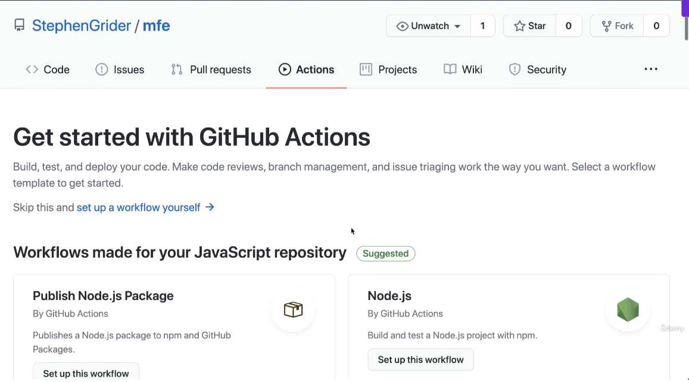
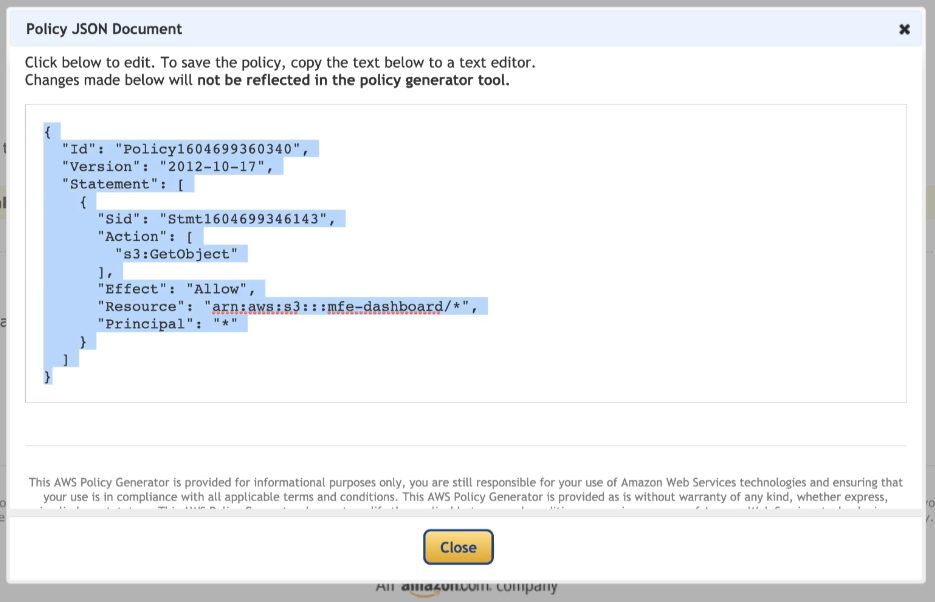
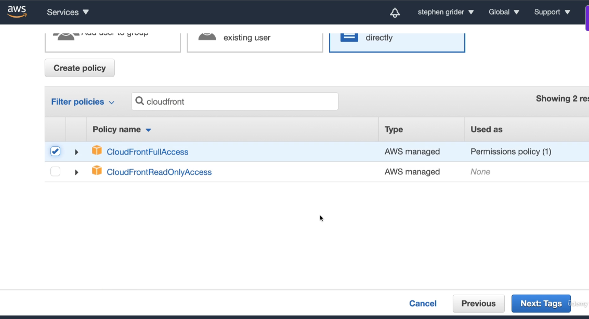

# Microfrontends in React
- Consider an ecommerce application
- 
- 
- To turn it into micro-frontend application
- Identify the major features
- 
- Split it into 2 applications
- 
- 
- 
- 
- We could have 2 separate teams to develop each of the applications
- 

## Application Overview
- We will make an ecommerce store
- 
- If we were making a monolithic app it will look like this
- 
- If we make a micro-frontend it will look like this:
- 
- How do we decide where to show each of these microfrontends on the screen
- So we can create a container app
- This container app decides when and where to show each micro-frontend
- 

### Understanding Build-time integration
- 
- 
- 
- 
- It is easy to set up and understand. However, container has to be re-deployed everytime ProductsList is updated
- It is tempting to couple the container and ProductsList together.

### Understanding the Run-time integration
- 
- Advantage of this approach is ProductsList can be deployed independently at any time
- Also, different versions of ProductsList can be deployed and Container can decide which one to use
- However, tooling and setup is far more complicated.
- 
- Run-time integration with Webpack module integration is usually the best approach

### Project Setup with Run-time integration
- We will create separate folders for each of our front-ends
- 
- 

### Understanding Webpack
- 
- Initially we used the fakers library to create a list of products in index.js as follows
```js
import faker from 'faker';
let products = '';
for(let i=0; i<3; i++){
    const name = faker.commerce.productName(i);
    products += `<div>${name}</div>`;
}

console.log(products);
```
- Now we created a webpack.config.js file and added the following code to it
```js
module.exports = {
    mode: "development",
};
```
- Then we went to package.json and in the scripts section added: "start":"webpack"
- When we ran npm run start, it created a dist folder which had a main.js file
- 
- Basically, Webpack is used to combine many JS files into a single JS file
- 
- When we load up our project in the browser, we dont want to load up a bunch of different files
- Thats where Webpack comes into play.
- It combines several JS files into a single file.
- main.js or bundle.js file is the output of webpack, it even includes the JS files of the dependencies we had included as well.
- In the above example, it included code for the faker library also
- We want to execute the main.js file in the browser and generate HTML
- So we need a webpack Dev Server
- 
- For this, we just need to make a small change in the webpack.config.js file
```js
module.exports = {
    mode: "development",
    devServer: {
        port: 8081,
    }
};

```
- Then we create an index.html page for Products
- Rather than explicitly referencing main.js file generated by webpack be added within script tags in the page, we will have Webpack figure it out for us
- Files generated by webpack have unpredictable names
- 
- So we will use webpack html plugin
- It will take a look at files coming out of webpack and automatically insert it into the HTML document
- 
- Make following changes to webpack.config.js file
```js
const HtmlWebpackPlugin = require('html-webpack-plugin');

module.exports = {
    mode: "development",
    devServer: {
        port: 8081,
    },
    plugins: [
        new HtmlWebpackPlugin({
            template: './public/index.html',
        })
    ]
};
```
- When we now run npm run start, it will start up the server and show contents of what we have logged
- 
- if we update index.js, it is automatically picked up by webpack and content inside the browser is automatically refreshed.

### Scaffolding the Container
- We will do the exact same steps as we did for Product earlier and have an empty HTML page, add the webpack.config.js files and add an index.js file which is as follows
```js
console.log('Container');
```
- We will also have a webpack.config.js file
```js
const HtmlWebpackPlugin = require("html-webpack-plugin");

module.exports = {
    mode: 'development',
    devServer: {
        port: 8080,
    },
    plugins: [
        new HtmlWebpackPlugin({
            template: './public/index.html',
        })
    ]
}
```

## Basics of Module Federation
- Now we need to set up our integration process.
- We need to call Products from the Container
- 
- For this go to the products folder and inside its webpack.config.js add the following code
```js
const HtmlWebpackPlugin = require('html-webpack-plugin');
const ModuleFederationPlugin = require('webpack/lib/container/ModuleFederationPlugin');
module.exports = {
    mode: "development",
    devServer: {
        port: 8081,
    },
    plugins: [
        new ModuleFederationPlugin({
            name: 'products',
            filename: 'remoteEntry.js',
            exposes:{
                './ProductsIndex':'./src/index'
            }
        }),
        new HtmlWebpackPlugin({
            template: './public/index.html',
        })
    ]
};
```
- Note that remoteEntry.js specifies the various modules that can be loaded from the Products project
- Further, in the webpack.config.js file of the container application, we have this code:
```js
const HtmlWebpackPlugin = require("html-webpack-plugin");
const ModuleFederationPlugin = require("webpack/lib/container/ModuleFederationPlugin");
module.exports = {
    mode: 'development',
    devServer: {
        port: 8080,
    },
    plugins: [
        new ModuleFederationPlugin({
            name: 'container',
            remotes:{
                products : 'products@http://localhost:8081/remoteEntry.js'
            }
        }),
        new HtmlWebpackPlugin({
            template: './public/index.html',
        })
    ]
}
```
- This code looks mysterious at first
- Notice that when we run the products code(running on localhost:8081) from container project(localhost:8080), we can go to network tab and see this
- 
- Notice that 3 files are coming from localhost:8081
- We can explain this process with the following diagram:
- 
- Think of remoteEntry.js file as a sort of directions for other projects. 
- These directions tell the container how to load source code from the products project
- The src/index.js contains the actual code exposed by the products project
- Micro-frontends in React using the Module Federation Plugin (part of Webpack 5) allow you to break a large React application into smaller, independently deployable modules. 
- Each module can be developed, tested, and deployed separately, yet they integrate seamlessly at runtime. This approach improves scalability, team autonomy, and code maintainability.
- Module Federation enables a JavaScript application to dynamically load code from another application or module at runtime.
- Each micro-frontend is a standalone app with its own build process, but they share dependencies and expose components or modules to one another.
- A host application loads remote modules (exposed by other apps) using Webpack's configuration.
- Real-World Examples
- E-commerce Platform: A retail site splits its UI into micro-frontends:
- Product catalog (React app)
- Shopping cart (React app)
- User authentication (React app) Each team works independently, deploying updates without affecting others. 
- The cart module can be reused across the main site and mobile app.

### Understanding how Module Federation Plugin works in Container Application
- 
- Why do we need index.js file inside container application? Especially when all it contains is import('./bootstrap')
- This basically is because Webpack knows that it is has to fetch something from products before running this file
- 
- The bootstrap.js file contains:
```js
import 'products/ProductsIndex';

console.log('Container');
```
- Overall the big picture looks like this:
- 
- This can further be explained by this
- 

### Understanding Configuration Options inside the Module Federation Plugin
- 
- Notice that inside bootstrap.js we have:
```js
import 'products/ProductsIndex';

console.log('Container');
```
- This basically looks for 'products' inside the remotes section of the Module Federation Plugin inside webpack.config.js file of the container application
- There we can find the location of products list(in this case: localhost:8081/remoteEntry.js)
- 
- We can have multiple modules or components or files inside the Products application
- We can choose what to expose to the outside containers
- Another example is this
- 
- Let's just say we just want barchart
- We can specify that as following in the Container
- 

### Scaffolding the Cart
- 
- We will do the same exact steps as product
- Add a package.json and install all the dependencies(same as product)
- Next, add an index.js and add the following code to it
```js
import faker from "faker";

const cartText = `<div>You have ${faker.random.number()} 
                        items in your cart</div>`

document.querySelector("#dev-cart").innerHTML = cartText;
```
- Next add an index.html with the following code:
```html
<!DOCTYPE html>
<html>
<head>

</head>
<body>
<div id="dev-cart"></div>
</body>
</html>
```
- Next add a webpack.config.js and expose the cart Index page
```js
const HtmlWebpackPlugin = require('html-webpack-plugin');
const ModuleFederationPlugin = require('webpack/lib/container/ModuleFederationPlugin');

module.exports = {
    mode: 'development',
    devServer: {
        port: 8082,
    },
    plugins: [
        new ModuleFederationPlugin({
            name: 'cart',
            filename: 'remoteEntry.js',
            exposes:{
                './CartShow':'./src/index'
            }
        }),
        new HtmlWebpackPlugin({
            template: './public/index.html'
        })
    ]
}
```
- If we just run the cart in isolation we get this:
- 

### Cart Integration
- First modify the webpack.config.js file of container application as follows:
```js
const HtmlWebpackPlugin = require("html-webpack-plugin");
const ModuleFederationPlugin = require("webpack/lib/container/ModuleFederationPlugin");
module.exports = {
    mode: 'development',
    devServer: {
        port: 8080,
    },
    plugins: [
        new ModuleFederationPlugin({
            name: 'container',
            remotes:{
                products : 'products@http://localhost:8081/remoteEntry.js',
                cart:'cart@http://localhost:8082/remoteEntry.js',
            }
        }),
        new HtmlWebpackPlugin({
            template: './public/index.html',
        })
    ]
}
```
- Next add the cart import to boostrap:
```js
import 'products/ProductsIndex';
import 'cart/CartShow'

console.log('Container');
```
- Next add a div with id of dev-cart inside the index.html file of the container app
```html

<!DOCTYPE html>
<html>
<head></head>
<body>
<div id="dev-products"></div>
<div id="dev-cart"></div>
</body>
</html>
```
- Finally, when we run it, we can see this
- 
- Notice that we can see items in the cart alongside the products list

### What the development process looks like while using Micro-frontends
- 
- Notice the role of the html files
- ~~~~
- We only use HTML files from the container application in Production
- HTML files from products and cart are only for testing in development process

## Sharing Dependencies Between Apps
- Both Products and Cart need the faker module
- 
- As we can see the faker dependency is being loaded twice(notice the vendor-node_modules file)
- 
- It is almost 2.9 MB large
- We would want both Product and Cart to share this dependency and load it up only once not twice
- We can do this as follows:
- 
- We just need to change a couple of configuration options
- We include the option of shared
```js
const HtmlWebpackPlugin = require('html-webpack-plugin');
const ModuleFederationPlugin = require('webpack/lib/container/ModuleFederationPlugin');
module.exports = {
    mode: "development",
    devServer: {
        port: 8081,
    },
    plugins: [
        new ModuleFederationPlugin({
            name: 'products',
            filename: 'remoteEntry.js',
            exposes:{
                './ProductsIndex':'./src/index'
            },
            shared:['faker'],
        }),
        new HtmlWebpackPlugin({
            template: './public/index.html',
        })
    ]
};
```
- We would do the same changes to cart
- No changes to container are required
- Notice that the vendor-node_modules_faker_index_js.js file is loaded only once
- 
- But now Product Application doesnot work in isolation
- 
- Since faker is marked as a shared module, it only loads up asynchronously. 
- It is not available for use inside the index.js file of Products
- Remote Entry file has the time to load it up asynchronously, but it doesnot work in direct access to Products Application
- Everything works inside the Container App but Cart App and Products App are broken

### Async Script Loading
- To fix this, we use the same pattern we use inside our container project
- Add a bootstrap.js file inside the src folder and copy paste the code from index.js into bootstrap.js
- Inside the index.js file include the following code:
```js
import('./bootstrap');
```
- Now everything works
- 
- Container app also keeps working as before
- We just have an extra request for bootstrap.js file
- We need to do the same steps for Cart Application also

### Shared Module Versioning
- What if the faker module is on different versions on different applications
- If we install faker on cart app to be of 5.5.3 version and on products app to be 4.1.0 version
- In this case, inside the container app, the faker library is loaded twice
- 
- This is correct and expected as different projects use different versions
- We don't want our projects to use same copy of faker as they have different versions
- Module Federation plugin takes a look at the versions used in package.json of each of the projects
- If it detects different versions, it loads up both of them
- If they use the same version, it loads it up only once.

### Singleton Loading
- Inside the module federation plugin, there are other modules like React which cannot be loaded multiple times into the browser
- We cannot have multiple copies of React running
- To simulate this, lets install different incompatible versions of faker module
- Also lets change the product and cart webpack config file as follows:
```js
const HtmlWebpackPlugin = require('html-webpack-plugin');
const ModuleFederationPlugin = require('webpack/lib/container/ModuleFederationPlugin');
module.exports = {
    mode: "development",
    devServer: {
        port: 8081,
    },
    plugins: [
        new ModuleFederationPlugin({
            name: 'products',
            filename: 'remoteEntry.js',
            exposes:{
                './ProductsIndex':'./src/index'
            },
            shared:['faker'],
            // shared: {
            //     faker:{
            //         singleton: true,
            //     }
            // },
        }),
        new HtmlWebpackPlugin({
            template: './public/index.html',
        })
    ]
};
```
- Notice that we are forcing it use a singleton object for faker module
- Products will have 4.1.0 and Cart will have 5.1.0 version
- When we run container, it will load up one copy, but it will also show a warning message:
- 
- It is a sign from webpack saying it was not able to load up the versions as expected.

### Sub-App Execution Context
- Remember that we still need to run Products and Cart independently of the Container
- But we are making a very big assumption
- Remember we load up everything inside the div with an id: "dev-products" and "dev-cart"
- We expect the container app to have the same div ids.
- This may not be always possible as all 3 application are developed by different teams
- We need to refactor our bootstrap.js file in product and cart applications
- We make the following changes to our bootstrap.js in products to handle all the scenarios
```js
import faker from 'faker';

const mount = (el) =>{
    let products = '';
    for(let i=0; i<5; i++){
        const name = faker.commerce.productName(i);
        products += `<div>${name}</div>`;
    }

    el.innerHTML = products;
    //Can work with different frameworks like React
    //ReactDOM.render(<App />,el);
}

//Context/Situation #1
// Running this file in development in isolation with an id of dev-products
//We want to render our app into an id of dev-products
//Remember in webpack config we set mode to development or production
if(process.env.NODE_ENV !== 'production'){
 const el = document.querySelector('#dev-products');
 //Assuming our container doesnot have an element with id of dev-products
 if(el)
 {
     //We are probably running in isolation
     mount(el);
 }
}


//Context/Situation #2
//Running this file in development or product through container app
//No guarantee that an element with id of dev-products might exist
//So we donot want to immediately render the app, if element doesnot exist
//We will not call the mount function immediately
//Using the export function, we can force the container to decide when to load the app on the screen
export {mount};

```
- Now if run the products app in isolation, it works fine.
- But now we will also have to make some changes to the container app since we are now exporting the mount function
- Before, we make changes to container, we need to change webpack.config file to refer to the bootstrap file instead
```js
 exposes:{
                './ProductsIndex':'./src/bootstrap'
         },
```
- Next we will make changes to bootstrap.js file of container as follows
- Note that it is importing the mount function and using that function to display products using its own custom div ID
```js
import {mount} from 'products/ProductsIndex';
import 'cart/CartShow'

console.log('Container');

mount(document.querySelector('#my-products'));
```
- We will make similar changes to cart also
- Change the bootstrap file as follows:
```js
import faker from "faker";


const mount = (element) => {
    const cartText = `<div>You have ${faker.random.number()} 
                        items in your cart</div>`
    element.innerHTML = cartText;
}

// Running in Development Environment
if(process.env.NODE_ENV !== "production") {
    const el = document.querySelector('#dev-cart');
    if(el) {
        mount(el);
    }
}

//Running in Production
export {mount};
```
- Change the webpack.config of cart as follows
```js
 exposes:{
                './CartShow':'./src/bootstrap'
         },
```
- Change the code for bootstrap.js for container app as follows:
```js
import {mount} from 'products/ProductsIndex';
import {mount as mountCart}  from 'cart/CartShow';


console.log('Container');

mount(document.querySelector('#my-products'));
mountCart(document.querySelector('#my-cart'));
```

### Bug in Module Federation Plugin
- Remember we had to provide a name to our export inside webpack.config file
```js
plugins: [
        new ModuleFederationPlugin({
            name: 'cart',
            filename: 'remoteEntry.js',
            exposes:{
                './CartShow':'./src/bootstrap'
            },
            shared: ['faker'],
            // shared: {
            //     faker:{
            //         singleton: true,
            //     }
            // },
        }),
```
- Then when we import it inside container we have the following:
```js
const HtmlWebpackPlugin = require("html-webpack-plugin");
const ModuleFederationPlugin = require("webpack/lib/container/ModuleFederationPlugin");
module.exports = {
    mode: 'development',
    devServer: {
        port: 8080,
    },
    plugins: [
        new ModuleFederationPlugin({
            name: 'container',
            remotes:{
                products : 'products@http://localhost:8081/remoteEntry.js',
                cart:'cart@http://localhost:8082/remoteEntry.js',
            }
        }),
        new HtmlWebpackPlugin({
            template: './public/index.html',
        })
    ]
}
```
- However there is a bug
- Inside the remoteEntry.js file we have this variable
- 
- This cart variable loads up all the code inside that remoteEntry file
- If we change cart:'cart@http://localhost:8082/remoteEntry.js' to cart:'mycart@http://localhost:8082/remoteEntry.js',
- We now start seeing an error
- We have to be careful as to how to name the cart variable.
- But now lets say we go to our index.html file and change selector in container index.html file from 'my-cart' to just 'cart'
- We also make similar changes in our bootstrap.js to reference this cart selector as follows
```js
//mountCart(document.querySelector('#my-cart'));
mountCart(document.querySelector('#cart'));
```
- In theory everything should work fine.
- But we get this error:
- 
- This is because cart is being created a global variable
- 
- 
- This is really misleading and is a BUG in Module Federation Plugin
- If we have a selector inside HTML as the same name as what we are trying to expose('cart' in this case)
- It will give error as that selector id #cart will overwrite the 'cart' global variable that is being exposed from cart application 
- We need to make sure our elements in our DOM don't have the same ID which is exposed inside the remoteEntry.js file

## Linking Multiple Apps Together
- We will build a software as a service application
-  (Landing Page)
-  (Pricing Page)
-  (Sign In Page)
-  (SignUp Page)
-  (Dashboard Page)
- We can group these pages together
- 
- We will build 3 different micro-frontends:
- 
- Please note integration techniques are identical irrespective of the frontend technology used

### Establishing the Requirements that drive architecture choices
- 
- 
- Our Project has specific requirements:
- 
- We can only use shared libraries through module federation system
- If there is tight coupling between Marketing and Authentication, if in the future, we replace Marketing, we will need to make changes to Authentication also
- In some years, React will be an ancient framework
- It is better to isolate applications
- 
- We also need to make sure if the user logs in, then we should change text of Login button to Logout button
- We need to have some communication between child and parent
- 
- 
- 

### Initial Webpack Config
- We don't use create-react-app or Vue CLI because both are currently shipping with a version of webpack that doesnot have Module Federation Plugin
- Remember Module Federation Plugin was introduced in Webpack 5
- This may change in the future
- 
- We will create 2 files for webpack instead of 1 file being used earlier.
- We need to specify Webpack configs for Production and Development
- We will have a third file which will have some configuration common for both development and production
- This pattern will be common for all projects
- To start off inside the marketing project, we will create a folder: config and inside that specify 3 files
- webpack.common.js, webpack.dev.js and webpack.prod.js
- Inside the webpack.common.js we will have the following code
```js
module.exports = {
    module: {
        rules: [
            //Loader tells Webpack to process some different files as we start to import them to our project
            //First loader we use is Babel, which is in charge of processing all code from ES2015,16,17,etc to regular ES5 code
            //which can easily be executed inside a typical browser
            {
                //Process all mjs and js files by babel
                test: /\.m?js$/,
                exclude: /node_modules/,
                use:{
                    loader: 'babel-loader',
                    options: {
                        //babel will process all JSX tags
                        presets: ['@babel/preset-react','@babel/preset-env'],
                        //Add in some code to enable some additional features like async/await syntax
                        plugins:['@babel/plugin-transform-runtime']
                    }
                }
            }
        ]
    }
}
```
- Inside the webpack.dev.config, we will have the following code:
```js
//Can be used to merge 2 different webpack config objects
//Helps to merge webpack config from the common file into dev config
const {merge} = require('webpack-merge');
const HtmlWebpackPlugin = require('html-webpack-plugin');
const commonConfig = require('./webpack.common');

const devConfig = {
    mode: 'development',
    devServer: {
        port: 8081,
        historyApiFallback: {
            index: 'index.html',
        }
    },
    plugins: [
        new HtmlWebpackPlugin({
            template: './public/index.html',
        })
    ]
};

//export the merge of common config and devConfig
module.exports = merge(commonConfig, devConfig)

```
- We will create a src/index.js file and public/index.html file and run the marketing project
- Remember earlier when we had 2 projects which were sharing dependencies and when we had to run them in isolation, they used to fail
- We added a bootstrap.js and imported it inside index.js file
- We are going to do something similar for marketing project
- We will create a bootstrap.js and add the following code:
```js
import React  from "react";
import ReactDOM from "react-dom";

// Mount function to start up the app
//Inside this function, we call ReactDOM.render method to display the text inside a placeholder on the page
const mount = (el) =>{
    ReactDOM.render(
        <h1>Hi there!</h1>,
        el
    )
}
// If we are in development and in isolation
// Call mount immediately
if(process.env.NODE_ENV === "development"){
    const devRoot = document.querySelector('#_marketing-dev-root');
    if(devRoot){
        mount(devRoot);
    }
}

//We are running through container, and we should export the mount function
export {mount};
```

## Generic Ties between Projects
- First we are going to import the Landing and Pricing Components and display them 
- Rather than dump everything in bootstrap.js file, we are going to create another file app.js with the following code:
```js
import React from 'react';
import {Switch, Route, BrowserRouter} from 'react-router-dom';
import {StylesProvider} from '@material-ui/core/styles';

import Landing from './components/Landing';
import Pricing from './components/Pricing';

export default () =>{
    return <div>
        <StylesProvider>
            <BrowserRouter>
                <Switch>
                    <Route exact path="/pricing" component={Pricing} />
                    <Route exact path="/" component={Landing} />
                </Switch>
            </BrowserRouter>
        </StylesProvider>
    </div>
}
```
- Now we are going to call this inside bootstrap.js file and render the App 
```js
import React  from "react";
import ReactDOM from "react-dom";
import App from "./App";

// Mount function to start up the app
const mount = (el) =>{
    ReactDOM.render(
        <App/>,
        el
    )
}
// If we are in development and in isolation
// Call mount immediately
if(process.env.NODE_ENV === "development"){
    const devRoot = document.querySelector('#_marketing-dev-root');
    if(devRoot){
        mount(devRoot);
    }
}

//We are running through container, and we should export the mount function
export {mount};
```
- This shows output as follows:
- 

### Setting up the Container
- We will follow the same steps
- Setup webpack.dev.config, webpack.common.config and webpack.prod.config files
- Then we will setup src folder with bootstrap.js and index.js
- Then we will create a public folder with index.html file inside of it
- Inside our bootstrap.js we will have the following code:
```js
import React  from "react";
import ReactDOM from "react-dom";
import App from "./App";

ReactDOM.render(<App />, document.querySelector("#root"));
```
- We will create a file App.js and have the following code inside of it
```js
import React from 'react';

export default () =>{
    return <h1>Hi there!</h1>
}
```

### Integration of Container and Marketing
- We are again going to make use of the Module Federation Plugin
- From the marketing app, we are going to expose the bootstrap file
- For this we will make the following changes in webpack.dev.js file for marketing
```js
//Can be used to merge 2 different webpack config objects
//Helps to merge webpack config from the common file into dev config
const {merge} = require('webpack-merge');
const HtmlWebpackPlugin = require('html-webpack-plugin');
const ModuleFederationPlugin = require('webpack/lib/container/ModuleFederationPlugin');
const commonConfig = require('./webpack.common');


const devConfig = {
    mode: 'development',
    devServer: {
        port: 8081,
        historyApiFallback: {
            index: 'index.html',
        }
    },
    plugins: [
        new ModuleFederationPlugin({
            name: 'marketing',
            filename: 'remoteEntry.js',
            exposes: {
                './MarketingApp': './src/bootstrap'
            }
        }),
        new HtmlWebpackPlugin({
            template: './public/index.html',
        })
    ]
};

//export the merge of common config and devConfig
module.exports = merge(commonConfig, devConfig)

```
- From the container app we are going to import the remoteEntry file exposed by marketing app
- For this we will make the following changes to webpack.dev.config file for container
```js
//Can be used to merge 2 different webpack config objects
//Helps to merge webpack config from the common file into dev config
const {merge} = require('webpack-merge');
const HtmlWebpackPlugin = require('html-webpack-plugin');
const ModuleFederationPlugin = require('webpack/lib/container/ModuleFederationPlugin');
const commonConfig = require('./webpack.common');

const devConfig = {
    mode: 'development',
    devServer: {
        port: 8080,
        historyApiFallback: {
            index: 'index.html',
        }
    },
    plugins: [
        new ModuleFederationPlugin({
            name:'container',
            remotes:{
                marketing: 'marketing@http://localhost:8081/remoteEntry.js'
            }
        }),
        new HtmlWebpackPlugin({
            template: './public/index.html',
        })
    ]
};

//export the merge of common config and devConfig
module.exports = merge(commonConfig, devConfig)

```
- Now we can use this inside our App.js file inside container like this
```js
import React from 'react';
import {mount} from 'marketing/MarketingApp'

console.log(mount)

export default () =>{
    return <h1>Hi there!</h1>
}
```

### Why import the mount function?
- The mount function takes in an HTML element as an argument and displays some content inside of it
- 
- But a question arises, why cant the Marketing App expose a React component which we can use inside container
- This is because of inflexible requirement #2. There should be zero coupling between container and child apps
- 
- What if container is in Vue.js and marketing is in React.js
- We want communication to be as generic as possible
- This is why we use a mount function

### Generic Integration(Using mount function inside the container app)
- First of all we will create a marketing component inside the container app
- This component takes an import of the mount function and passes reference to its own div to render the content from marketing
```js
import {mount} from 'marketing/MarketingApp'
import React,{useRef,useEffect} from 'react'

export default () =>{
    const ref = useRef(null)
    useEffect(()=>{
     mount(ref.current)
    })
    return <div ref={ref}>

    </div>
}
```
- Now we will use this component inside container's App.js file like this:
```js
import React from 'react';
import MarketingApp from "./components/MarketingApp";

export default () =>{
    return <>
    <h1>Hi there!</h1>
        <hr/>
        <MarketingApp />
    </>
}
```
- This renders the application like this:
- 
- 
- Note that when we load up the container app, it has files from both container app and marketing app
- Note that 2 copies of React are being loaded as container uses React and Marketing uses React
- For this we can use the shared option of the Module Federation Plugin:
- First we will make changes to webpack.dev.config inside marketing app
```js
//Can be used to merge 2 different webpack config objects
//Helps to merge webpack config from the common file into dev config
const {merge} = require('webpack-merge');
const HtmlWebpackPlugin = require('html-webpack-plugin');
const ModuleFederationPlugin = require('webpack/lib/container/ModuleFederationPlugin');
const commonConfig = require('./webpack.common');


const devConfig = {
    mode: 'development',
    devServer: {
        port: 8081,
        historyApiFallback: {
            index: 'index.html',
        }
    },
    plugins: [
        new ModuleFederationPlugin({
            name: 'marketing',
            filename: 'remoteEntry.js',
            exposes: {
                './MarketingApp': './src/bootstrap'
            },
            shared: ['react', 'react-dom'],
        }),
        new HtmlWebpackPlugin({
            template: './public/index.html',
        })
    ]
};

//export the merge of common config and devConfig
module.exports = merge(commonConfig, devConfig)

```
- Similarly we will make changes to webpack.dev.config inside container app
```js
//Can be used to merge 2 different webpack config objects
//Helps to merge webpack config from the common file into dev config
const {merge} = require('webpack-merge');
const HtmlWebpackPlugin = require('html-webpack-plugin');
const ModuleFederationPlugin = require('webpack/lib/container/ModuleFederationPlugin');
const commonConfig = require('./webpack.common');

const devConfig = {
    mode: 'development',
    devServer: {
        port: 8080,
        historyApiFallback: {
            index: 'index.html',
        }
    },
    plugins: [
        new ModuleFederationPlugin({
            name:'container',
            remotes:{
                marketing: 'marketing@http://localhost:8081/remoteEntry.js'
            },
            shared: ['react', 'react-dom'],
        }),
        new HtmlWebpackPlugin({
            template: './public/index.html',
        })
    ]
};

//export the merge of common config and devConfig
module.exports = merge(commonConfig, devConfig)

```
- Now when we load up container app, we see something like this:
- 
- It might get tedious to write up these shared modules array
- One option is to get the packageJson as a JSON object inside our webpack.dev.config file
- We can then pass the dependencies to the shared array as follows:
```js
//Can be used to merge 2 different webpack config objects
//Helps to merge webpack config from the common file into dev config
const {merge} = require('webpack-merge');
const HtmlWebpackPlugin = require('html-webpack-plugin');
const ModuleFederationPlugin = require('webpack/lib/container/ModuleFederationPlugin');
const commonConfig = require('./webpack.common');
const packageJson = require('../package.json');


const devConfig = {
    mode: 'development',
    devServer: {
        port: 8081,
        historyApiFallback: {
            index: 'index.html',
        }
    },
    plugins: [
        new ModuleFederationPlugin({
            name: 'marketing',
            filename: 'remoteEntry.js',
            exposes: {
                './MarketingApp': './src/bootstrap'
            },
            //shared: ['react', 'react-dom'],
            shared: packageJson.dependencies,
        }),
        new HtmlWebpackPlugin({
            template: './public/index.html',
        })
    ]
};

//export the merge of common config and devConfig
module.exports = merge(commonConfig, devConfig)

```

## Implementing a CI/CD Pipeline
- 
- Once our code gets processed by webpack, it loads up a file main.js into the browser
- Then it makes a follow-up request to get the remoteEntry.js from marketing
- The location of that file must be known at build-time.
- 
- Having a fixed name of remoteEntry.js file can lead to caching issues.
- 
- 
- 
- 

### Initial Git Setup
- 
- Use the git init command to initialize a new git repo
- Create a new gitignore file
- Use the command git status to verify if the gitignore file is created in the right location
- Use the commands
```shell
git add .
git commit -m "Initial Commit"
```
- The above commands will create an initial commit
- Take the github repository url
- Run the command
```shell
git remote add origin git@github.com:ntaneja1985/mfe.git

git push origin main
```
- The above commands will push code to github repository
- 

### Production Webpack Config for Container
- Specify the following in the webpack.prod.config file:
- Here we will merge both common and prod config files
```js
//merge the common and prod.js file
const {merge} = require('webpack-merge');
const ModuleFederationPlugin = require('webpack/lib/container/ModuleFederationPlugin');
const commonConfig = require('./webpack.common.js');
const packageJson = require('../package.json');

const domain = process.env.PRODUCTION_DOMAIN;

const prodConfig = {
    //When we set mode to production, Module Federation Plugin will optimize JS files
    //It will bundle and minify them for production
    mode: 'production',
    output: {
        //All files for production will use this as a template to name them
        //This will fix the caching issues
        filename: '[name].[contenthash].js',
    },
    plugins: [
        new ModuleFederationPlugin({
            name: 'container',
            remotes: {
                //fetch the remote entry file from the domain specified in environment variables
                marketing: `marketing@${domain}/marketing/remoteEntry.js`,
            },
            shared: packageJson.dependencies,
        }),
    ]
};

module.exports = merge(commonConfig, prodConfig);
```
- Remember in dev, we used to use HtmlWebpackPlugin to serve an index.html page.
- We will move that particular setup to webpack.common.js file
```js
const HtmlWebpackPlugin = require('html-webpack-plugin');

module.exports = {
    module: {
        rules: [
            //Loader tells Webpack to process some different files as we start to import them to our project
            //First loader we use is Babel, which is in charge of processing all code from ES2015,16,17,etc to regular ES5 code
            //which can easily be executed inside a typical browser
            {
                //Process all mjs and js files by babel
                test: /\.m?js$/,
                exclude: /node_modules/,
                use:{
                    loader: 'babel-loader',
                    options: {
                        //babel will process all JSX tags
                        presets: ['@babel/preset-react','@babel/preset-env'],
                        //Add in some code to enable some additional features like async/await syntax
                        plugins:['@babel/plugin-transform-runtime']
                    }
                }
            }
        ]
    },
    plugins: [
        new HtmlWebpackPlugin({
            template: './public/index.html',
        }),
    ]
}
```
- Next, we will write a build command inside the package JSON file to build the config
- Webpack processes all your source files (JavaScript, CSS, images, etc.) and combines them into optimized output files
```js
"scripts": {
    "start": "webpack serve --config config/webpack.dev.js",
    "build": "webpack --config config/webpack.prod.js"
  },
```
- The --config config/webpack.prod.js flag tells webpack to use the production-specific configuration file, which typically includes:
- Code minification and compression
- Dead code elimination (tree shaking)
- Asset optimization
- Production-specific environment variables
- Remember we had set up filenaming convention as [name].[contenthash].js
- Look at the files generated:
- 
- The long alphanumeric strings in the filenames (like 3f726d308966d312bb17) are content hashes. This is a webpack optimization feature that:
- Enables efficient browser caching
- Ensures files are re-downloaded only when their content changes
- Helps with cache busting in production deployments
- The multiple JavaScript files indicate that your webpack configuration is using code splitting, which breaks your application into smaller chunks for better performance and loading optimization.
- This is exactly what you'd expect to see after running your webpack --config config/webpack.prod.js build command - your source code has been successfully bundled, optimized, and prepared for production deployment.

### Production Webpack Config for Marketing
- It will be similar to Production Config for container except that it will expose the contents of marketing
```js
const {merge} = require('webpack-merge');
const ModuleFederationPlugin = require('webpack/lib/container/ModuleFederationPlugin');
const packageJson = require('../package.json');
const commonConfig = require('./webpack.common.js');

const prodConfig = {
    mode: 'production',
    output: {
        filename: '[name].[contenthash].js',
    },
    plugins: [
        new ModuleFederationPlugin({
            name: 'marketing',
            filename: 'remoteEntry.js',
            exposes:{
                './MarketingApp': './src/bootstrap'
            },
            shared: packageJson.dependencies
        })
    ]
};

module.exports = merge(commonConfig, prodConfig)

```
- So similar to container, we will add a build script inside the package.Json and it will product a dist folder
- 

### Understanding CI/CD pipelines
- We will use Github Actions to implement CI/CD pipeline
- 
- 

### Creating the container Action
- We can use the Actions Tab in Github
- 
- We can have a built-in editor of Github or we can write it ourselves
- We will create a directory: .github/workflows/container.yml
- Even github creates it in the same way:
- 
- Create the following YAML file
```yaml
name: deploy-container

# How to run on events
on:
  push:
    branches:
      - main
    # Run only when changes are made inside the container project
    paths:
      - 'packages/container/**'

# Set the execution environment to container folder
defaults:
  run:
    working-directory: packages/container

# Can have multiple jobs, but they all run in parallel
# Can have one job just to build our project and another to deploy it
jobs:
  build:
    # Which type of virtual machine this pipeline should run on
    runs-on: ubuntu-latest

    steps:
      - uses: actions/checkout@v2
      - run: npm install
      - run: npm run build

      # Gain access to AWS CLI to run AWS Specific Commands
      - uses: chrislennon/action-aws-cli@1.1
      # Sync the dist folder, generated as result of npm run build to the AWS Bucket
      - run: aws s3 sync dist s3://${{secrets.AWS_S3_BUCKET_NAME}}/container/latest
      # Specify details of the S3 environment
        env:
          AWS_ACCESS_KEY_ID: $ {{ secrets.AWS_ACCESS_KEY_ID }}
          AWS_SECRET_ACCESS_KEY: ${{secrets.AWS_SECRET_ACCESS_KEY }}

```
- 

## Deployment to AWS
- S3 bucket is a large cloud based harddrive to store files
- We can make these files available via AWS Cloudfront
- Search for S3 Bucket
- 
- 
- 
- To Allow anonymous access and allow static file hosting to the s3 bucket, do this
- 
- 
- We will uncheck the setting that blocks all public access
- 
- 

### Authoring a Bucket Policy
- 
- Policies on AWS, allows various services to talk to each other and access various services inside of it
- 
- We will create a policy that will allow our AWS Cloudfront Service to access all the files in the S3 bucket
- 
- 
- 
- 
- 
- 

### Setting up the Cloudfront Distribution
- A distribution is a set of files we want to make available to the outside world
- 
- 
- We will create a web distribution
- 
- 
- 
- 
- 
- 
- 
- 
- The application will be available here:
- 
- We now need to sync our project back to S3

### Creating and Assigning Keys
- Remember this code in our Github Action file
```yaml
 # Gain access to AWS CLI to run AWS Specific Commands
      - uses: chrislennon/action-aws-cli@1.1
      # Sync the dist folder, generated as result of npm run build to the AWS Bucket
      - run: aws s3 sync dist s3://${{secrets.AWS_S3_BUCKET_NAME}}/container/latest
      # Specify details of the S3 environment
        env:
          AWS_ACCESS_KEY_ID: $ {{ secrets.AWS_ACCESS_KEY_ID }}
          AWS_SECRET_ACCESS_KEY: ${{secrets.AWS_SECRET_ACCESS_KEY }}
```
- We need to setup these 3 environment variables
- In AWS, we will generate access key and secret access key
- We will use IAM to generate access keys
- 
- 
- 
- We will use the least responsibility principle
- 
- 
- So basically in IAM, we will create a user(with programmatic access), that has full access to s3 bucket and cloudfront
- 
- So we will get the Access Key and Secret Access Key
- We will copy over these to the settings in our repository
- 
- 
- 
- 

### Re-Running the Build
- 
- We will see a blank screen and error like this
- 
- Micro-frontend apps usually have these kind of errors.
- main.js is not at the root directory
- AWS is trying to load up main.js from the root directory
- It is nested inside container/latest
- 
- We need our MFP plugin to load up the main.js from the correct path
- Go to webpack.prod.js file
- We need to specify the publicPath option
- publicPath tells webpack where your application's assets (JavaScript files, CSS, images, etc.) will be served from when the application runs in production.
- We will have the following in our webpack.prod.js file
```js
//merge the common and prod.js file
const {merge} = require('webpack-merge');
const ModuleFederationPlugin = require('webpack/lib/container/ModuleFederationPlugin');
const commonConfig = require('./webpack.common.js');
const packageJson = require('../package.json');

const domain = process.env.PRODUCTION_DOMAIN;

const prodConfig = {
    //When we set mode to production, Module Federation Plugin will optimize JS files
    //It will bundle and minify them for production
    mode: 'production',
    output: {
        //All files for production will use this as a template to name them
        //This will fix the caching issues
        filename: '[name].[contenthash].js',
        //Take all the filenames generated by MFP plugin and pre-pend them with this path
        publicPath: '/container/latest/'
    },
    plugins: [
        new ModuleFederationPlugin({
            name: 'container',
            remotes: {
                //fetch the remote entry file from the domain specified in environment variables
                marketing: `marketing@${domain}/marketing/remoteEntry.js`,
            },
            shared: packageJson.dependencies,
        }),
    ]
};

module.exports = merge(commonConfig, prodConfig);
```
- Asset Location: All generated files will be served from the /container/latest/ directory
- File Naming: Files get names like main.abc123.js (with content hash for cache busting)
- Full URLs: When webpack generates references to these files, they become /container/latest/main.abc123.js

### Example Flow
- Your container app gets deployed to a server
- Files are placed in the /container/latest/ directory
- The remoteEntry.js file is accessible at /container/latest/remoteEntry.js
- When other microfrontends want to consume your modules, they fetch from this known path
- Any dynamic imports or chunks will also be loaded from /container/latest/

- We can now push our changes to github
- Github will detect the change and start the build
- It will automatically be deployed to AWS S3 bucket

## Microfrontend-Specific AWS Config

### Manual Cache Invalidations
- When we create a new distribution, Cloudfront takes a look at all the files in our bucket.
- If we add new files, cloudfront will add those as well.
- Cloudfront doesnot automatically look at any changed files
- Cloudfront ignores all updates made to the file
- So we need to create an invalidation
- It is a manual way of telling cloudfront that it needs to use the latest version of our file
- 
- 
- 

### Automated Invalidation
- When we deploy our application, we dont want to manually do invalidation every time.
- We need to serve the latest version of our files automatically
- We can use AWS CLI to automatically create an invalidation for us
- Make changes to container.yaml file
```yaml
      # Add automated invalidation to force Cloudfront to use the latest version of the files
      - run: aws cloudfront create-invalidation --distribution-id ${{ secrets.AWS_DISTRIBUTION_ID }} --paths "container/latest/index.html"
        env:
          AWS_ACCESS_KEY_ID: $ {{ secrets.AWS_ACCESS_KEY_ID }}
          AWS_SECRET_ACCESS_KEY: ${{secrets.AWS_SECRET_ACCESS_KEY }}
```
- 
- 
- Automated invalidation takes place
- 

### Setting up Marketing Deployment
- Our marketing yaml file is similar as container.yml file, except that container is replaced with marketing
- Remember inside our webpack.prod.config for container we had specified that the domain needs to be fetched from an environment variable
```js
const domain = process.env.PRODUCTION_DOMAIN;

const prodConfig = {
    //When we set mode to production, Module Federation Plugin will optimize JS files
    //It will bundle and minify them for production
    mode: 'production',
    output: {
        //All files for production will use this as a template to name them
        //This will fix the caching issues
        filename: '[name].[contenthash].js',
        //Take all the filenames generated by MFP plugin and pre-pend them with this path
        publicPath: '/container/latest/'
    },
    plugins: [
        new ModuleFederationPlugin({
            name: 'container',
            remotes: {
                //fetch the remote entry file from the domain specified in environment variables
                marketing: `marketing@${domain}/marketing/remoteEntry.js`,
            },
            shared: packageJson.dependencies,
        }),
    ]
};
```
- Now we need to setup this domain environment variable
- Copy the URL
- 
- Add a new secret in Github repo
- 
- 
- Now modify container.yml to include the environment variable
```yaml
    steps:
      - uses: actions/checkout@v2
      - run: npm install
      - run: npm run build
        env:
          PRODUCTION_DOMAIN: $ {{ secrets.PRODUCTION_DOMAIN }}
```
- We will also have to update public path property inside the marketing webpack.prod.config file
```js
const prodConfig = {
    mode: 'production',
    output: {
        filename: '[name].[contenthash].js',
        //Take all the filenames generated by MFP plugin and pre-pend them with this path
        publicPath: '/marketing/latest/'
    },
    plugins: [
        new ModuleFederationPlugin({
            name: 'marketing',
            filename: 'remoteEntry.js',
            exposes:{
                './MarketingApp': './src/bootstrap'
            },
            shared: packageJson.dependencies
        })
    ]
};
```
- 
- 
- 
- 

### Production-Style Workflow
- We dont work off the main branch
- We usually create PRs and they are merged into main branch
- 
- We will create a new branch
- 
- Make changes and push
- 
- 
- 

## Handling CSS in Micro-frontends
- We had a Header component to container app
```js
import React from 'react';
import MarketingApp from "./components/MarketingApp";
import Header from "./components/Header";
import {BrowserRouter} from "react-router-dom";


export default () =>{
    return <>
        <BrowserRouter>
            <div>
        <Header />
        <MarketingApp />
            </div>
        </BrowserRouter>
    </>
}
```
- We can see it works fine in development environment
- 
- But when we push to production, we see it like this
- 
- There are some challenges in handling CSS in microfrontend applications
- 
- 
- We may see the Pricing Header as green
- If any of our microfrontend projects have different CSS, CSS from one project may impact another project
- We need to solve this

### CSS Scoping Techniques
- We need to write CSS that only affects one project and not the other projects
- 
- We can use a CSS in JS library
- 
- Vue and Angular have built in component style scoping
- For namespacing all our CSS, at the root element of our project, we can add a class for.e.g like pricing or auth for authentication application
- 
- However, it may be difficult to remember the scope each time we make changes to Sign In Page CSS
- What if CSS comes from a CSS library like bootstrap
- We can choose a component library that does css-in-js
- One example is Material UI which makes use of css-in-js
- What if we use a shared css library
- 
- But it violates the principle of loose-coupling.
- We probably don't want to use same the CSS library across all projects
- What if we use different version of bootstrap in different projects
- 
- It seems CSS-in-JS library option is the best

### Understanding CSS in JS libraries
- 
- The reason why our app is not working is production is because we have a className collision
- 
- Material UI has a makeStyle method that takes all of our classes and generates a randomly-generated className
```js
const useStyles = makeStyles((theme) => ({
    '@global': {
        a: {
            textDecoration: 'none',
        },
    },
    icon: {
        marginRight: theme.spacing(2),
    },
    heroContent: {
        backgroundColor: theme.palette.background.paper,
        padding: theme.spacing(8, 0, 6),
    },
    heroButtons: {
        marginTop: theme.spacing(4),
    }
}));

const cards = [1, 2, 3, 4, 5, 6, 7, 8, 9];

export default function Album() {
    const classes = useStyles();

    return (
        <React.Fragment>
            <main>
                {/* Hero unit */}
                <div className={classes.heroContent}>
                    <Container maxWidth="sm">
                        <Typography
                            component="h1"
                            variant="h2"
                            align="center"
                            color="textPrimary"
                            gutterBottom
                        >
                            Home Page
                        </Typography>
        </React.Fragment>
)
```
- 
- In production, selector is minified to jss1,jss2 etc
- 
- 
- Whereas in development we have:
- 
- The classNames are different in production and development because in production, the selectors are minified
- This is causing classNames collisions
- 
- 
- Notice that we have 2 different styling coming from our container and marketing application
- This is causing the issues we are seeing

### Fixing the ClassName collisions
- Fixing it is going be pretty simple and straightforward.
- When we build each of our different subprojects, rather than having our CSS in JS library use a not so random class name of JSS 1, 2, 3, 4.
- We will have it generate a slightly different style of className right here.
- We will make sure that this string is actually sufficiently random that it's not going collide against some randomly generated class name for another project.
- Remember in Marketing App.JS we had added a StylesProvider
- StylesProvider is a React component that is used to customize CSS and JS generation stuff
- We will give this component an option to make sure it generates all the classNames for Production in a random manner.
- Inside the App.js for marketing, do the following changes
```js
import {StylesProvider, createGenerateClassName} from '@material-ui/core/styles';

const generateClassName = createGenerateClassName({
    //Rather than generating classNames with prefix of jss, generate them with prefix of 'ma'
    productionPrefix: 'ma'
});

export default () =>{
    return <div>
        <StylesProvider generateClassName={generateClassName}>
            <BrowserRouter>
                <Switch>
                    <Route exact path="/pricing" component={Pricing} />
                    <Route exact path="/" component={Landing} />
                </Switch>
            </BrowserRouter>
        </StylesProvider>
    </div>
}
```
- We need to do something similar for container as well(note the production prefix is different)
```js
import React from 'react';
import MarketingApp from "./components/MarketingApp";
import Header from "./components/Header";
import {BrowserRouter} from "react-router-dom";
import {StylesProvider, createGenerateClassName} from '@material-ui/core/styles';

const generateClassName = createGenerateClassName({
    //Rather than generating classNames with prefix of jss, generate them with prefix of 'co'
    productionPrefix: 'co'
});


export default () =>{
    return <>
        <StylesProvider generateClassName={generateClassName}>
        <BrowserRouter>
            <div>
        <Header />
        <MarketingApp />
            </div>
        </BrowserRouter>
            </StylesProvider>
    </>
}
```
- Last thing we need to do is to redeploy to production
- 
- 
- 

## Implementing Multi-Tier Navigation

### Requirements
- Navigation inside our application is broken
- Routing Logic is needed inside both container and sub-applications
- 
- 
- 
- 
- 
- Navigation should work both inside the container mode and in independent development mode
- 
- 
- Communication between sub-apps must be as generic as possible

### Possible Solutions
- 
- 
- Here both container and marketing can have their own separate copy of React-Router
- 
- 

#### How Routing Libraries work
- There are several routing libraries like React-Router, Vue-Router, Angular-Router and so on.
- These routing libraries consist of 2 different parts:
- History Object and Router
- 
- All routing libraties implement 3 different kind of history objects
- There are 3 different methods of deciding what route a user is currently visiting inside our application
- First method is the browser history object
- 
- Another kind is hash history
- 
- Another history is Memory History inside the router itself
- 
- We have multi-tier routing approach
- 
- We can tell react router which kind of history to use.
- 
- Different libraries have their own history implementations
- 
- So we will setup Browser History for container and Memory History for Container and authentication
- If we go to App.js file for container, we find the following code:
```jsx
export default () =>{
    return <>
        <StylesProvider generateClassName={generateClassName}>
            // This already implements Browser History
            <BrowserRouter>
                <div>
                    <Header />
                    <MarketingApp />
                </div>
            </BrowserRouter>
        </StylesProvider>
    </>
}
```
- Next, for marketing we have the following code:
- We are using Browser History for marketing and we need to update it to use Memory History
```jsx
export default () =>{
    return <div>
        <StylesProvider generateClassName={generateClassName}>
            <BrowserRouter>
                <Switch>
                    <Route exact path="/pricing" component={Pricing} />
                    <Route exact path="/" component={Landing} />
                </Switch>
            </BrowserRouter>
        </StylesProvider>
    </div>
}
```
### Using Memory History
- We will replace BrowserRouter with Router
- We will create our history object inside bootstrap.js file and provide it to the App component
- We will add this code inside our bootstrap.js file
```jsx
import {createMemoryHistory} from "history";

// Mount function to start up the app
const mount = (el) =>{

    const history = createMemoryHistory();
    ReactDOM.render(
        <App history = {history}/>,
        el
    )
}


```
- Then inside our App.js we will have the following code:
```jsx
export default ({history}) =>{
    return <div>
        <StylesProvider generateClassName={generateClassName}>
            <Router history={history}>
                <Switch>
                    <Route exact path="/pricing" component={Pricing} />
                    <Route exact path="/" component={Landing} />
                </Switch>
            </Router>
        </StylesProvider>
    </div>
}
```
- However we see strange results, when we navigate to pricing, we dont see the URL changing
- Also when we click on the "App" link to go to Homepage, nothing happens
- Our routing logic above is broken
- 
- When we click on pricing link the Browser history for container has not changed
- 
- We need to sync all these history objects together
- 

### Communication between Microfrontend Apps
- We have these requirements
- 
- Communication should be generic, as we may change router technology in the future
- We need to use simple events, callbacks etc

### Communication through Callbacks
- 
- Container will pass a callback onNavigate() to marketing app when it calls its mount function
- The marketing app's mount function will take the onNavigate() callback function and call it whenever its URL or path changes
- For this we will make changes to MarketingApp.js component inside container as follows:
```jsx
export default () =>{
    const ref = useRef(null)
    useEffect(()=>{
        mount(ref.current,{
            onNavigate : ()=> {
                console.log('The container noticed navigation in Marketing')
            },
        })
    })
    return <div ref={ref}>

    </div>
}
```
- Next we will update mount function in bootstrap.js file in marketing application as follows:
```jsx
const mount = (el,{onNavigate}) =>{

    const history = createMemoryHistory();

    //Whenever the URL changes or path changes, we will call this function of container app
    history.listen(onNavigate)
    ReactDOM.render(
        <App history = {history}/>,
        el
    )
}
```
- 
- We now need to use that callback function to update Browser History inside the container


### Syncing History Objects
- The listen function from the MemoryHistory object in Marketing App also provides the location
- We can use it inside MarketingApp.js inside container as follows:
```jsx
export default () =>{
    const ref = useRef(null)
    useEffect(()=>{
        mount(ref.current,{
            onNavigate : (location)=> {
                console.log(location)
                console.log('The container noticed navigation in Marketing')
            },
        })
    })
    return <div ref={ref}>

    </div>
}
```
- 
- Observe the pathName
- We will use this property to update the container browser history
- We will do these changes inside MarketingApp in container application
```jsx
import {mount} from 'marketing/MarketingApp'
import React,{useRef,useEffect} from 'react'
import {useHistory} from 'react-router-dom'

export default () =>{
    const ref = useRef(null)
    //Copy of the browser history inside the container
    const history = useHistory()
    useEffect(()=>{
     mount(ref.current,{
         //Get the path Name from the location object passed from history.listen() method of memoryHistory inside Marketing Application
         onNavigate : ({pathName : nextPathName})=> {
             console.log(nextPathName);
             console.log('The container noticed navigation in Marketing')
             //Update history object of Container App
             history.push(nextPathName);
         },
     })
    })
    return <div ref={ref}>

    </div>
}
```
- But we can get into an infinite loop here
- Each history object keeps telling itself that path changed
- So we need to add in a check
```jsx
import {mount} from 'marketing/MarketingApp'
import React,{useRef,useEffect} from 'react'
import {useHistory} from 'react-router-dom'

export default () =>{
    const ref = useRef(null)
    //Copy of the browser history inside the container
    const history = useHistory()
    useEffect(()=>{
     mount(ref.current,{
         onNavigate : ({pathName : nextPathName})=> {
             console.log(nextPathName);
             console.log('The container noticed navigation in Marketing')
             //Check if the current pathName inside Browser history is not the same as pathName passed from Marketing Application
             if(history.location.pathname !== nextPathName){
                 //Update history object of Container App
                 history.push(nextPathName);
             }
         },
     })
    })
    return <div ref={ref}>

    </div>
}
```
### Running Memory History in Isolation
- If we run Marketing App in isolation we get this error:
- 
- This is because onNavigate parameter is not defined when we run the app in isolation
- To fix this we make the following changes in bootstrap.js file:
```jsx
import React  from "react";
import ReactDOM from "react-dom";
import App from "./App";
import {createMemoryHistory} from "history";

// Mount function to start up the app
const mount = (el,{onNavigate}) =>{

    const history = createMemoryHistory();

    //Whenever the URL changes or path changes, we will call this function
    if(onNavigate){
        history.listen(onNavigate)
    }
    
    ReactDOM.render(
        <App history = {history}/>,
        el
    )
}
// If we are in development and in isolation
// Call mount immediately
if(process.env.NODE_ENV === "development"){
    const devRoot = document.querySelector('#_marketing-dev-root');
    if(devRoot){
        mount(devRoot,{});
    }
}

//We are running through container, and we should export the mount function
export {mount};
```


### Communication from Container App to Marketing App
- 
- We will add a method that will be returned from the mount function defined in bootstrap.js of Marketing App
```jsx
const mount = (el,{onNavigate}) =>{

    const history = createMemoryHistory();

    //Whenever the URL changes or path changes, we will call this function
    if(onNavigate){
        history.listen(onNavigate)
    }

    ReactDOM.render(
        <App history = {history}/>,
        el
    )

    return {
        onParentNavigate(){
            console.log('Container just navigated')

        }
    };
}
```
- This function will be returned to the container app, and the container app can use its browser history's listen function to call this function
- Code changes to container app will be as follows:
```jsx
import {mount} from 'marketing/MarketingApp'
import React,{useRef,useEffect} from 'react'
import {useHistory} from 'react-router-dom'

export default () =>{
    const ref = useRef(null)
    //Copy of the browser history inside the container
    const history = useHistory()
    useEffect(()=>{
     const {onParentNavigate} = mount(ref.current,{
         onNavigate : ({pathName : nextPathName})=> {
             console.log(nextPathName);
             console.log('The container noticed navigation in Marketing')
             //Check if the current pathName inside Browser history is not the same as pathName passed from Marketing Application
             if(history.location.pathname !== nextPathName){
                 //Update history object of Container App
                 history.push(nextPathName);
             }
         },
     })

        history.listen(onParentNavigate);
    },[])
    return <div ref={ref}>

    </div>
}
```
- 
- Make changes to bootstrap.js to update the pathName in Memory History of Marketing Application from the Parent(Container Application) browser history
```jsx
// Mount function to start up the app
const mount = (el,{onNavigate}) =>{

    const history = createMemoryHistory();

    //Whenever the URL changes or path changes, we will call this function
    if(onNavigate){
        history.listen(onNavigate)
    }

    ReactDOM.render(
        <App history = {history}/>,
        el
    )

    return {
        onParentNavigate({pathName : nextPathName}){
            console.log('Container just navigated')
            //Check if the current pathName inside Memory history is not the same as pathName passed from Parent Container Application
            if(history.location.pathname !== nextPathName){
                history.push(nextPathName);
            }
        }
    };
}
```

### Using Browser History in isolation
- If we run Marketing App in isolation, we are using Memory History
- This doesn't change anything in the address bar.
- This can be confusing.
- If we are using Marketing App in isolation, we should use Browser History object rather than Memory History
- Inside the mount function, we will pass the defaultHistory parameter initially set to createBrowserHistory
- We will check inside the mount function, that if default history object is provided, then use that or else createMemoryHistory
```jsx
import React  from "react";
import ReactDOM from "react-dom";
import App from "./App";
import {createMemoryHistory, createBrowserHistory} from "history";

// Mount function to start up the app
const mount = (el,{onNavigate, defaultHistory}) =>{

    //If default history is passed, use it or use createMemoryHistory
    const history = defaultHistory || createMemoryHistory;

    //Whenever the URL changes or path changes, we will call this function
    if(onNavigate){
        history.listen(onNavigate)
    }

    ReactDOM.render(
        <App history = {history}/>,
        el
    )
    
    return {
      onParentNavigate({pathName : nextPathName}){
          console.log('Container just navigated')
          //Check if the current pathName inside Memory history is not the same as pathName passed from Parent Container Application
          if(history.location.pathname !== nextPathName){
              history.push(nextPathName);
          }
      }  
    };
}
// If we are in development and in isolation
// Call mount immediately
if(process.env.NODE_ENV === "development"){
    const devRoot = document.querySelector('#_marketing-dev-root');
    if(devRoot){
        mount(devRoot,{defaultHistory: createBrowserHistory()});
    }
}

//We are running through container, and we should export the mount function
export {mount};
```
- Now navigation inside Marketing App works when running it in isolation
- 

## Performance Considerations
- We will set up the Auth App exactly like we setup the Marketing App
- We will add components for SignIn and SignUp
- However, when we start Auth app at localhost:8082 and navigate to localhost:8082/auth/sigin, we get this error:
- 
- Remember the public path property we had set up when we were deploying our application to AWS, so that remoteEntry file knows where the files where which were created by Webpack
- That public path property is important when we are running in development mode also
- 
- 
- That's why we get this error:
- 
- main.js is not at localhost:8082/auth/main.js rather it is at localhost:8082/main.js
- We can try to fix it by specifying a publicPath:
- 
- This would create problems later
- 
- This would load up the main.js from the container app and not from the auth app
- So setting publicPath to "/" will make the auth app work fine in development(running in isolation), but not when it is integrated with container app
- 
- Fixing it is easy
- 
- 
- Problem arises in Auth App and not in Marketing app because we have nested routes in Auth App like 'auth/signup' and 'auth/signin'
- So we will fix it as follows for all of our 3 projects
```js
const devConfig = {
    mode: 'development',
    output:{
        publicPath: 'http://localhost:8082/',
    },
    devServer: {
        port: 8082,
        historyApiFallback: {
            index: '/index.html',
        }
    },
    plugins: [
        new ModuleFederationPlugin({
            name: 'auth',
            filename: 'remoteEntry.js',
            exposes: {
                './AuthApp': './src/bootstrap'
            },
            //shared: ['react', 'react-dom'],
            shared: packageJson.dependencies,
        }),
        new HtmlWebpackPlugin({
            template: './public/index.html',
        })
    ]
};
```
- 
- 

### Integrating Auth App into the Container App
- We will create a component AuthApp inside container /src/components folder
- We will make changes to App.js in container app as follows:
```jsx
import React from 'react';
import MarketingApp from "./components/MarketingApp";
import Header from "./components/Header";
import {BrowserRouter, Route,Switch} from "react-router-dom";
import {StylesProvider, createGenerateClassName} from '@material-ui/core/styles';
import AuthApp from "./components/AuthApp";

const generateClassName = createGenerateClassName({
    //Rather than generating classNames with prefix of jss, generate them with prefix of 'co'
    productionPrefix: 'co'
});


export default () =>{
    return <>
        <StylesProvider generateClassName={generateClassName}>
        <BrowserRouter>
            <div>
        <Header />
        <Switch>
            <Route exact path="/auth" component={AuthApp} />
            <Route exact path="/" component={MarketingApp} />
        </Switch>
            </div>
        </BrowserRouter>
            </StylesProvider>
    </>
}
```
### Adding Initial State to Memory History
- 
- We will modify the mount function in the bootstrap.js file of AuthApp to have some initialPath
```jsx
// Mount function to start up the app
const mount = (el,{onNavigate, defaultHistory, initialPath}) =>{

    //If default history is passed, use it or use createMemoryHistory
    const history = defaultHistory || createMemoryHistory({
        initialEntries: [initialPath],
    });

    //Whenever the URL changes or path changes, we will call this function
    if(onNavigate){
        history.listen(onNavigate)
    }

    ReactDOM.render(
        <App history = {history}/>,
        el
    )
```
- Then when we call the mount() function inside Auth App's bootstrap.js file from Container App's AuthApp.js we will include the following code:
```jsx
export default () =>{
    const ref = useRef(null)
    //Copy of the browser history inside the container
    const history = useHistory()
    useEffect(()=>{
        const {onParentNavigate} = mount(ref.current,{
            initialPath: history.location.pathname,
            onNavigate : ({pathName : nextPathName})=> {
                console.log(nextPathName);
                console.log('The container noticed navigation in Auth App')
                //Check if the current pathName inside Browser history is not the same as pathName passed from Marketing Application
                if(history.location.pathname !== nextPathName){
                    //Update history object of Container App
                    history.push(nextPathName);
                }
            },
        })

        history.listen(onParentNavigate);
    },[])
```

### Lazily Loading SubApps
- Let's say we navigate to the homepage
- Then we want that the code for marketing app and container app should only load
- The code for Auth App should not be loaded at that point
- Only when we navigate to the Auth page, then the code for the Auth App should load
- Basically, we want lazy loading and not eager loading
- We can make use of lazy and Suspense from React
- We will modify the App.js inside container app to include the following code:
```jsx
import React,{lazy,Suspense} from 'react';

import Header from "./components/Header";
import {BrowserRouter, Route,Switch} from "react-router-dom";
import {StylesProvider, createGenerateClassName} from '@material-ui/core/styles';

const MarketingLazy = lazy(() => import("./components/MarketingApp"));
const AuthLazy = lazy(() => import("./components/AuthApp"));

const generateClassName = createGenerateClassName({
    //Rather than generating classNames with prefix of jss, generate them with prefix of 'co'
    productionPrefix: 'co'
});


export default () =>{
    return <>
        <StylesProvider generateClassName={generateClassName}>
        <BrowserRouter>
            <div>
        <Header />
                <Suspense fallback={<div>Loading...</div>}>
        <Switch>
                <Route path="/auth" component={AuthLazy} />
            <Route path="/" component={MarketingLazy} />
        </Switch>
                </Suspense>
            </div>
        </BrowserRouter>
            </StylesProvider>
    </>
}
```
- Note that when we run the app, we only load up bootstrap.js from Marketing App and Container App and not from the AuthApp
- 
- 
- 

### Adding a Loading Bar
- Add the following component to Container App
```jsx
import React from 'react';
import {makeStyles,createStyles} from "@material-ui/core/styles";
import LinearProgress from "@material-ui/core/LinearProgress";

const useStyles = makeStyles((theme) => {
    return createStyles({
        bar:{
            width:'100%',
            '& > * + *':{
                marginTop:theme.spacing(2),
            }
        }
    });
});

export default () =>{
    const classes = useStyles();
    return (
        <div className={classes.bar}>
            <LinearProgress/>
        </div>
    )
}
```
- Modify the App.js to include this Progress bar in the fallback
```jsx
import Progress from "./components/Progress";
export default () =>{
    return <>
        <StylesProvider generateClassName={generateClassName}>
            <BrowserRouter>
                <div>
                    <Header />
                    <Suspense fallback={<Progress/>}>
                        <Switch>
                            <Route path="/auth" component={AuthLazy} />
                            <Route path="/" component={MarketingLazy} />
                        </Switch>
                    </Suspense>
                </div>
            </BrowserRouter>
        </StylesProvider>
    </>
}
```

## Authentication in Microfrontends
- 
- 
- Auth App doesnot have any logic for enforcing permissions or allowing access to certain routes or figuring out if user is logged in
- It is only for sign-in and sign-up
- We should centralize authentication logic inside Container App
- Container App will communicate to each sub-app regarding the user's authentication status
- 
- We will pass an onSignIn method from container to the auth app
```jsx
export default () =>{
    const ref = useRef(null)
    //Copy of the browser history inside the container
    const history = useHistory()
    useEffect(()=>{
        const {onParentNavigate} = mount(ref.current,{
            initialPath: history.location.pathname,
            onSignIn: () =>{
                console.log("User signed in")
            },
            onNavigate : ({pathName : nextPathName})=> {
                console.log(nextPathName);
                console.log('The container noticed navigation in Auth App')
                //Check if the current pathName inside Browser history is not the same as pathName passed from Marketing Application
                if(history.location.pathname !== nextPathName){
                    //Update history object of Container App
                    history.push(nextPathName);
                }
            },
        })

        history.listen(onParentNavigate);
    },[])
    return <div ref={ref}>

    </div>
}
```
- In the Auth App's bootstrap.js we will pass in this method to the SignIn function inside the SignIn component
```jsx
 ReactDOM.render(
    <App onSignIn={onSignIn} history = {history}/>,
    el
)
```
- Inside app.js of Auth App we will have this code:
```jsx
export default ({history, onSignIn}) =>{
    return <div>
        <StylesProvider generateClassName={generateClassName}>
            <Router history={history}>
                <Switch>
                    <Route path="/auth/signin">
                        <SignIn onSignIn={onSignIn} />
                    </Route>
                    <Route path="/auth/signup" >
                        <SignUp onSignIn={onSignIn} />
                    </Route>
                </Switch>
            </Router>
        </StylesProvider>
    </div>
}
```
- Finally inside the SignIn component we will have this code:
```jsx
<Button
            type="submit"
            fullWidth
            variant="contained"
            color="primary"
            className={classes.submit}
            onClick={onSignIn}
          >
```
- 
- We can pass Authentication state to our components as follows:
```jsx
import React,{lazy,Suspense, useState} from 'react';

import Header from "./components/Header";
import Progress from "./components/Progress";
import {BrowserRouter, Route,Switch} from "react-router-dom";
import {StylesProvider, createGenerateClassName} from '@material-ui/core/styles';

const MarketingLazy = lazy(() => import("./components/MarketingApp"));
const AuthLazy = lazy(() => import("./components/AuthApp"));

const generateClassName = createGenerateClassName({
    //Rather than generating classNames with prefix of jss, generate them with prefix of 'co'
    productionPrefix: 'co'
});


export default () =>{
    const [isSignedIn, setIsSignedIn] = React.useState(false);
    return <>
        <StylesProvider generateClassName={generateClassName}>
        <BrowserRouter>
            <div>
        <Header isSignedIn={isSignedIn} />
                <Suspense fallback={<Progress/>}>
        <Switch>
                <Route path="/auth">
                    <AuthLazy onSignIn = {()=> setIsSignedIn(true)}/>
                </Route>
            <Route path="/" component={MarketingLazy} />
        </Switch>
                </Suspense>
            </div>
        </BrowserRouter>
            </StylesProvider>
    </>
}
```
- 
- To update isSignIn state onSignout, use this code:
```jsx
export default () =>{
    const [isSignedIn, setIsSignedIn] = React.useState(false);
    return <>
        <StylesProvider generateClassName={generateClassName}>
            <BrowserRouter>
                <div>
                    <Header onSignOut={()=>{setIsSignedIn(false)}} isSignedIn={isSignedIn} />
                    <Suspense fallback={<Progress/>}>
                        <Switch>
                            <Route path="/auth">
                                <AuthLazy onSignIn = {()=> setIsSignedIn(true)}/>
                            </Route>
                            <Route path="/" component={MarketingLazy} />
                        </Switch>
                    </Suspense>
                </div>
            </BrowserRouter>
        </StylesProvider>
    </>
}
```
- And inside Header.js file we have
```jsx
export default function Header({ isSignedIn, onSignOut }) {
    const classes = useStyles();

    const onClick = () => {
        if (isSignedIn && onSignOut) {
            onSignOut();
        }
    };

```

### Adding an Auth Deploy yaml file
```yaml
name: deploy-auth

# How to run on events
on:
  push:
    branches:
      - main
    # Run only when changes are made inside the container project
    paths:
      - 'packages/auth/**'

# Set the execution environment to container folder
defaults:
  run:
    working-directory: packages/auth

# Can have multiple jobs, but they all run in parallel
# Can have one job just to build our project and another to deploy it
jobs:
  build:
    # Which type of virtual machine this pipeline should run on
    runs-on: ubuntu-latest

    steps:
      - uses: actions/checkout@v2
      - run: npm install
      - run: npm run build

      # Gain access to AWS CLI to run AWS Specific Commands
      - uses: chrislennon/action-aws-cli@1.1
      # Sync the dist folder, generated as result of npm run build to the AWS Bucket
      - run: aws s3 sync dist s3://${{secrets.AWS_S3_BUCKET_NAME}}/auth/latest
        # Specify details of the S3 environment
        env:
          AWS_ACCESS_KEY_ID: $ {{ secrets.AWS_ACCESS_KEY_ID }}
          AWS_SECRET_ACCESS_KEY: ${{secrets.AWS_SECRET_ACCESS_KEY }}

      # Add automated invalidation to force Cloudfront to use the latest version of the files
      - run: aws cloudfront create-invalidation --distribution-id ${{ secrets.AWS_DISTRIBUTION_ID }} --paths "auth/latest/index.html"
        env:
          AWS_ACCESS_KEY_ID: $ {{ secrets.AWS_ACCESS_KEY_ID }}
          AWS_SECRET_ACCESS_KEY: ${{secrets.AWS_SECRET_ACCESS_KEY }}
```


